# 02 — Database Design
**Workforce Management Platform — MongoDB Atlas**
Last updated: 2026-06-14 (v1.1 — High Severity Remediation Applied)

---

## Collections Summary

| Collection | Purpose | Cardinality | Status |
|---|---|---|---|
| `users` | All accounts: employees + admins | ~10–500 docs | Modified (v1.1) |
| `attendanceDays` | Aggregated daily attendance per employee | 1 per employee per calendar day | Modified (v1.1) |
| `attendanceSessions` | Individual check-in / check-out pairs | N per employee per day | Modified (v1.1) |
| `leaveRequests` | Leave applications + approval state | N per employee per year | Modified (v1.1) |
| `leaveTransactions` | Leave balance ledger — immutable | N per employee per leave event | **NEW (v1.1)** |
| `leaveYearAllocations` | Annual allocation records per employee | 1 per employee per leave type per year | **NEW (v1.1)** |
| `regularizationRequests` | Attendance correction requests + approval | N per employee per month | Unchanged |
| `holidays` | Company-declared holidays by year | ~15–30 per year | Unchanged |
| `companySettings` | Singleton — all company configuration | Always exactly 1 document | Modified (v1.1) |
| `notifications` | Push + email notification log | N per employee | Unchanged |
| `auditLogs` | Immutable audit trail | High-volume; TTL-managed | Modified (v1.1) |
| `payrollSummaries` | Monthly computed payroll per employee | 1 per employee per month | Modified (v1.1) |
| `deviceSessions` | Active refresh tokens per device | 1 per active device | Unchanged |
| `fcmTokens` | Firebase push tokens per device | 1 per active device | Unchanged |
| `passwordResetTokens` | Short-lived password reset tokens | 1 per active reset request | **NEW (v1.1)** |
| `usedNonces` | Consumed checkin/checkout nonces | TTL-managed (10 min) | **NEW (v1.1)** |
| `systemEvents` | Cron execution log + idempotency guard | 1 per cron run | **NEW (v1.2)** |

---

## ER Diagram

```mermaid
erDiagram
    users {
        ObjectId _id PK
        string employeeId UK
        string email UK
        string role
        boolean isActive
        object registeredDevice
        object leaveBalances
    }

    attendanceDays {
        ObjectId _id PK
        ObjectId employeeId FK
        string dateString UK
        string status
        number totalMinutes
        number overtimeMinutes
    }

    attendanceSessions {
        ObjectId _id PK
        ObjectId employeeId FK
        ObjectId attendanceDayId FK
        string dateString
        boolean isActive
        boolean closedBySystem
    }

    leaveRequests {
        ObjectId _id PK
        ObjectId employeeId FK
        ObjectId reviewedBy FK
        string status
        string leaveType
        number leaveYear
    }

    leaveTransactions {
        ObjectId _id PK
        ObjectId employeeId FK
        string leaveType
        number leaveYear
        string transactionType
        number days
        ObjectId referenceId FK
    }

    leaveYearAllocations {
        ObjectId _id PK
        ObjectId employeeId FK
        number leaveYear
        string leaveType
        number allocatedDays
        boolean isProRated
    }

    regularizationRequests {
        ObjectId _id PK
        ObjectId employeeId FK
        ObjectId reviewedBy FK
        string dateString
        string status
    }

    holidays {
        ObjectId _id PK
        string dateString UK
        string name
        number year
    }

    companySettings {
        string _id PK
        string workStartTime
        string workEndTime
        number leaveYearStartMonth
        number requiredDailyMinutes
        array workingDays
        object geoFence
        object leaveTypes
    }

    notifications {
        ObjectId _id PK
        ObjectId employeeId FK
        ObjectId referenceId
        string type
        boolean isRead
    }

    auditLogs {
        ObjectId _id PK
        ObjectId actorId FK
        string action
        string entityType
        ObjectId entityId
        Date timestamp
    }

    payrollSummaries {
        ObjectId _id PK
        ObjectId employeeId FK
        string yearMonth UK
        string status
        number effectiveWorkingDays
        number effectivePresentDays
        number payableAmount
    }

    deviceSessions {
        ObjectId _id PK
        ObjectId employeeId FK
        boolean isRevoked
        Date expiresAt
    }

    fcmTokens {
        ObjectId _id PK
        ObjectId employeeId FK
        string token UK
        boolean isActive
    }

    passwordResetTokens {
        ObjectId _id PK
        ObjectId userId FK
        string tokenHash
        Date expiresAt
        boolean isUsed
    }

    usedNonces {
        ObjectId _id PK
        ObjectId employeeId FK
        string nonce UK
        string action
        Date usedAt
    }

    systemEvents {
        ObjectId _id PK
        string type
        string targetKey
        string status
        Date startedAt
        Date completedAt
        number affectedCount
    }

    users ||--o{ attendanceDays : "has"
    users ||--o{ attendanceSessions : "has"
    users ||--o{ leaveRequests : "applies"
    users ||--o{ leaveTransactions : "has"
    users ||--o{ leaveYearAllocations : "has"
    users ||--o{ regularizationRequests : "applies"
    users ||--o{ payrollSummaries : "has"
    users ||--o{ notifications : "receives"
    users ||--o{ deviceSessions : "owns"
    users ||--o{ fcmTokens : "owns"
    users ||--o{ auditLogs : "performs"
    users ||--o{ passwordResetTokens : "requests"
    users ||--o{ usedNonces : "uses"
    users }o--o{ systemEvents : "triggers (admin)"

    attendanceDays ||--o{ attendanceSessions : "contains"
    attendanceDays |o--o| leaveRequests : "covered by"
    attendanceDays |o--o| regularizationRequests : "corrected by"

    leaveRequests }o--o| users : "reviewed by admin"
    leaveRequests ||--o{ leaveTransactions : "triggers"
    leaveYearAllocations ||--o{ leaveTransactions : "triggers"

    regularizationRequests }o--o| users : "reviewed by admin"
    payrollSummaries }o--o| users : "computed by admin"

    notifications }o--o| leaveRequests : "references"
    notifications }o--o| regularizationRequests : "references"
    notifications }o--o| payrollSummaries : "references"
```



---

## Collection Schemas

### 1. `users`

**Changes in v1.1:** `leaveBalances` restructured to separate `currentYear` / `carriedForward`; `carryForwardBalances[]` removed; `passwordResetToken` and `passwordResetExpiry` removed.

```typescript
// src/lib/models/User.ts
import mongoose, { Schema, Document, Model } from 'mongoose';

export type UserRole = 'admin' | 'employee';
export type LeaveTypeName = 'paidLeave' | 'sickLeave' | 'casualLeave';

export interface IRegisteredDevice {
  fingerprintHash: string;
  registeredAt: Date;
  deviceInfo: string;
  platform: 'android' | 'ios';
}

export interface ILeaveTypeBalance {
  currentYear: number;        // days from current leave year's allocation
  carriedForward: number;     // days carried from previous leave year
  carryForwardExpiry?: Date;  // null if no carry-forward
}

export interface ILeaveBalances {
  paidLeave: ILeaveTypeBalance;
  sickLeave: ILeaveTypeBalance;
  casualLeave: ILeaveTypeBalance;
}

export interface IUser extends Document {
  employeeId: string;
  firstName: string;
  lastName: string;
  email: string;
  passwordHash: string;
  role: UserRole;
  phone?: string;
  department?: string;
  designation?: string;
  monthlySalary: number;
  dateOfJoining: Date;
  dateOfLeaving?: Date;
  isActive: boolean;
  registeredDevice: IRegisteredDevice | null;
  leaveBalances: ILeaveBalances;
  createdAt: Date;
  updatedAt: Date;
  createdBy?: mongoose.Types.ObjectId;
}

const RegisteredDeviceSchema = new Schema<IRegisteredDevice>(
  {
    fingerprintHash: { type: String, required: true },
    registeredAt:   { type: Date,   required: true },
    deviceInfo:     { type: String, required: true },
    platform:       { type: String, enum: ['android', 'ios'], required: true },
  },
  { _id: false }
);

const LeaveTypeBalanceSchema = new Schema<ILeaveTypeBalance>(
  {
    currentYear:        { type: Number, required: true, min: 0, default: 0 },
    carriedForward:     { type: Number, required: true, min: 0, default: 0 },
    carryForwardExpiry: { type: Date },
  },
  { _id: false }
);

const LeaveBalancesSchema = new Schema<ILeaveBalances>(
  {
    paidLeave:   { type: LeaveTypeBalanceSchema, required: true, default: () => ({ currentYear: 0, carriedForward: 0 }) },
    sickLeave:   { type: LeaveTypeBalanceSchema, required: true, default: () => ({ currentYear: 0, carriedForward: 0 }) },
    casualLeave: { type: LeaveTypeBalanceSchema, required: true, default: () => ({ currentYear: 0, carriedForward: 0 }) },
  },
  { _id: false }
);

const UserSchema = new Schema<IUser>(
  {
    employeeId:    { type: String, required: true, unique: true, trim: true, uppercase: true },
    firstName:     { type: String, required: true, trim: true, maxlength: 100 },
    lastName:      { type: String, required: true, trim: true, maxlength: 100 },
    email:         { type: String, required: true, unique: true, trim: true, lowercase: true },
    passwordHash:  { type: String, required: true, select: false },
    role:          { type: String, enum: ['admin', 'employee'], required: true, default: 'employee' },
    phone:         { type: String, trim: true, maxlength: 20 },
    department:    { type: String, trim: true, maxlength: 100 },
    designation:   { type: String, trim: true, maxlength: 100 },
    monthlySalary: { type: Number, required: true, min: 0 },
    dateOfJoining: { type: Date,   required: true },
    dateOfLeaving: { type: Date },
    isActive:      { type: Boolean, required: true, default: true },

    registeredDevice: { type: RegisteredDeviceSchema, default: null },
    leaveBalances:    {
      type: LeaveBalancesSchema,
      required: true,
      default: () => ({
        paidLeave:   { currentYear: 0, carriedForward: 0 },
        sickLeave:   { currentYear: 0, carriedForward: 0 },
        casualLeave: { currentYear: 0, carriedForward: 0 },
      }),
    },

    createdBy: { type: Schema.Types.ObjectId, ref: 'User' },
  },
  { timestamps: true }
);

UserSchema.index({ email: 1 },      { unique: true });
UserSchema.index({ employeeId: 1 }, { unique: true });
UserSchema.index({ isActive: 1, role: 1 });
UserSchema.index({ role: 1 });
UserSchema.index({ department: 1 });

export const User: Model<IUser> =
  (mongoose.models['User'] as Model<IUser>) ??
  mongoose.model<IUser>('User', UserSchema);
```

**Constraints:**
- `leaveBalances.*.currentYear` and `carriedForward` are always ≥ 0. Enforced by atomic conditional update (see Transaction Strategy).
- Total balance helper: `currentYear + (carriedForward if carryForwardExpiry > now else 0)`. Computed in service, never stored.
- `passwordHash` has `select: false` — never returned in queries unless explicitly projected.
- Deactivated users (`isActive: false`) retain all historical data. No hard delete.
- `passwordResetToken` / `passwordResetExpiry` do NOT exist on this document — see `passwordResetTokens` collection.

---

### 2. `attendanceDays`

**Changes in v1.1:** `sessions[]` array removed (redundant with `attendanceSessions.attendanceDayId` FK); `overtimeMinutes` added.

```typescript
// src/lib/models/AttendanceDay.ts
import mongoose, { Schema, Document, Model } from 'mongoose';

export type AttendanceDayStatus =
  | 'present'
  | 'absent'
  | 'half-day'
  | 'leave'
  | 'holiday'
  | 'weekend'
  | 'lwp'
  | 'not-applicable';

export interface IAttendanceDay extends Document {
  employeeId: mongoose.Types.ObjectId;
  date: Date;
  dateString: string;
  year: number;
  month: number;

  status: AttendanceDayStatus;
  totalMinutes: number;
  requiredMinutes: number;
  overtimeMinutes: number;      // max(0, totalMinutes - requiredMinutes) — added v1.1

  leaveRequestId?: mongoose.Types.ObjectId;
  leaveType?: 'paidLeave' | 'sickLeave' | 'casualLeave' | 'lwp';
  leaveDuration?: 'full' | 'half';

  regularizationRequestId?: mongoose.Types.ObjectId;
  isRegularized: boolean;

  createdAt: Date;
  updatedAt: Date;
}

const AttendanceDaySchema = new Schema<IAttendanceDay>(
  {
    employeeId:   { type: Schema.Types.ObjectId, ref: 'User', required: true },
    date:         { type: Date,   required: true },
    dateString:   { type: String, required: true, match: /^\d{4}-\d{2}-\d{2}$/ },
    year:         { type: Number, required: true },
    month:        { type: Number, required: true, min: 1, max: 12 },

    status:          { type: String, enum: ['present','absent','half-day','leave','holiday','weekend','lwp','not-applicable'], required: true, default: 'absent' },
    totalMinutes:    { type: Number, required: true, default: 0, min: 0 },
    requiredMinutes: { type: Number, required: true, min: 0 },
    overtimeMinutes: { type: Number, required: true, default: 0, min: 0 },

    leaveRequestId:          { type: Schema.Types.ObjectId, ref: 'LeaveRequest' },
    leaveType:               { type: String, enum: ['paidLeave','sickLeave','casualLeave','lwp'] },
    leaveDuration:           { type: String, enum: ['full','half'] },

    regularizationRequestId: { type: Schema.Types.ObjectId, ref: 'RegularizationRequest' },
    isRegularized:           { type: Boolean, required: true, default: false },
  },
  { timestamps: true }
);

AttendanceDaySchema.index({ employeeId: 1, dateString: 1 }, { unique: true });
AttendanceDaySchema.index({ employeeId: 1, status: 1 });
AttendanceDaySchema.index({ employeeId: 1, year: 1, month: 1 });
AttendanceDaySchema.index({ dateString: 1 });

export const AttendanceDay: Model<IAttendanceDay> =
  (mongoose.models['AttendanceDay'] as Model<IAttendanceDay>) ??
  mongoose.model<IAttendanceDay>('AttendanceDay', AttendanceDaySchema);
```

**Constraints:**
- `sessions[]` array is intentionally absent. Fetch sessions via `AttendanceSession.find({ attendanceDayId })`.
- `overtimeMinutes = Math.max(0, totalMinutes - requiredMinutes)` — computed on every checkout/update.
- Status derivation priority: `not-applicable` > `holiday` > `weekend` > `leave`/`lwp` > attendance-based (`present`/`half-day`/`absent`).

---

### 3. `attendanceSessions`

**Changes in v1.1:** `closedBySystem` and `systemCloseReason` added; partial unique index added for active session constraint.

```typescript
// src/lib/models/AttendanceSession.ts
import mongoose, { Schema, Document, Model } from 'mongoose';

export interface IGeoPoint {
  latitude: number;
  longitude: number;
  accuracy: number;
  distanceFromOffice: number;
}

export interface ICheckInData extends IGeoPoint {
  timestamp: Date;
  deviceFingerprint: string;
  nonce: string;             // kept for audit reference — not used for uniqueness check
  isWithinGeoFence: boolean;
}

export interface ICheckOutData extends IGeoPoint {
  timestamp: Date;
  deviceFingerprint: string;
  nonce: string;
  isWithinGeoFence: boolean;
}

export interface IAttendanceFlags {
  lowGpsAccuracy: boolean;
  outsideGeoFence: boolean;
  suspiciousTimestamp: boolean;
  possibleMockGps: boolean;
}

export type SystemCloseReason = 'midnight-rollover' | 'admin-force-close';

export interface IAttendanceSession extends Document {
  employeeId: mongoose.Types.ObjectId;
  attendanceDayId: mongoose.Types.ObjectId;
  dateString: string;

  checkIn: ICheckInData;
  checkOut: ICheckOutData | null;

  durationMinutes: number | null;
  isActive: boolean;
  closedBySystem: boolean;          // true if auto-closed by midnight cron
  systemCloseReason?: SystemCloseReason;

  flags: IAttendanceFlags;

  createdAt: Date;
  updatedAt: Date;
}

const GeoPointFields = {
  latitude:           { type: Number, required: true, min: -90,  max: 90  },
  longitude:          { type: Number, required: true, min: -180, max: 180 },
  accuracy:           { type: Number, required: true, min: 0 },
  distanceFromOffice: { type: Number, required: true, min: 0 },
};

const CheckInSchema = new Schema<ICheckInData>(
  {
    ...GeoPointFields,
    timestamp:         { type: Date,    required: true },
    deviceFingerprint: { type: String,  required: true },
    nonce:             { type: String,  required: true },
    isWithinGeoFence:  { type: Boolean, required: true },
  },
  { _id: false }
);

const CheckOutSchema = new Schema<ICheckOutData>(
  {
    ...GeoPointFields,
    timestamp:         { type: Date,    required: true },
    deviceFingerprint: { type: String,  required: true },
    nonce:             { type: String,  required: true },
    isWithinGeoFence:  { type: Boolean, required: true },
  },
  { _id: false }
);

const FlagsSchema = new Schema<IAttendanceFlags>(
  {
    lowGpsAccuracy:      { type: Boolean, required: true, default: false },
    outsideGeoFence:     { type: Boolean, required: true, default: false },
    suspiciousTimestamp: { type: Boolean, required: true, default: false },
    possibleMockGps:     { type: Boolean, required: true, default: false },
  },
  { _id: false }
);

const AttendanceSessionSchema = new Schema<IAttendanceSession>(
  {
    employeeId:      { type: Schema.Types.ObjectId, ref: 'User',          required: true },
    attendanceDayId: { type: Schema.Types.ObjectId, ref: 'AttendanceDay', required: true },
    dateString:      { type: String, required: true, match: /^\d{4}-\d{2}-\d{2}$/ },

    checkIn:  { type: CheckInSchema,  required: true },
    checkOut: { type: CheckOutSchema, default: null  },

    durationMinutes:   { type: Number,  default: null, min: 0 },
    isActive:          { type: Boolean, required: true, default: true },
    closedBySystem:    { type: Boolean, required: true, default: false },
    systemCloseReason: { type: String,  enum: ['midnight-rollover', 'admin-force-close'] },

    flags: {
      type: FlagsSchema,
      required: true,
      default: () => ({ lowGpsAccuracy: false, outsideGeoFence: false, suspiciousTimestamp: false, possibleMockGps: false }),
    },
  },
  { timestamps: true }
);

// Partial unique index — DB-level guarantee: at most one isActive: true per employee
AttendanceSessionSchema.index(
  { employeeId: 1 },
  { unique: true, partialFilterExpression: { isActive: true }, name: 'unique_active_session_per_employee' }
);
AttendanceSessionSchema.index({ employeeId: 1, dateString: 1 });
AttendanceSessionSchema.index({ employeeId: 1, isActive: 1 });
AttendanceSessionSchema.index({ attendanceDayId: 1 });

export const AttendanceSession: Model<IAttendanceSession> =
  (mongoose.models['AttendanceSession'] as Model<IAttendanceSession>) ??
  mongoose.model<IAttendanceSession>('AttendanceSession', AttendanceSessionSchema);
```

**Constraints:**
- Partial unique index enforces at most one `isActive: true` per employee at the DB level. Duplicate key error code `11000` → `AppError('SESSION_ALREADY_ACTIVE', 'ATT_003')`.
- `nonce` field kept for audit reference. Uniqueness enforced by `usedNonces` collection, not this field.
- Auto-closed sessions: `durationMinutes` capped at `min(workEndTime, checkIn.timestamp + 16h) - checkIn.timestamp`.

---

### 4. `leaveRequests`

**Changes in v1.1:** `leaveYear` field added; `'revoked'` added to `LeaveStatus`; `revokedBy`, `revokedAt`, `revocationReason` added.

```typescript
// src/lib/models/LeaveRequest.ts
import mongoose, { Schema, Document, Model } from 'mongoose';

export type LeaveStatus   = 'pending' | 'approved' | 'rejected' | 'cancelled' | 'revoked';
export type LeaveType     = 'paidLeave' | 'sickLeave' | 'casualLeave' | 'lwp';
export type LeaveDuration = 'full' | 'half';

export interface ILeaveRequest extends Document {
  employeeId: mongoose.Types.ObjectId;
  leaveType: LeaveType;
  duration: LeaveDuration;
  startDate: Date;
  endDate: Date;
  totalDays: number;
  leaveYear: number;          // leave year this request belongs to (server-computed)
  reason: string;
  remarks?: string;
  status: LeaveStatus;

  reviewedBy?: mongoose.Types.ObjectId;
  reviewedAt?: Date;
  reviewRemarks?: string;

  revokedBy?: mongoose.Types.ObjectId;
  revokedAt?: Date;
  revocationReason?: string;

  affectedDates: string[];    // server-computed — never from client

  createdAt: Date;
  updatedAt: Date;
}

const LeaveRequestSchema = new Schema<ILeaveRequest>(
  {
    employeeId: { type: Schema.Types.ObjectId, ref: 'User', required: true },
    leaveType:  { type: String, enum: ['paidLeave','sickLeave','casualLeave','lwp'], required: true },
    duration:   { type: String, enum: ['full','half'], required: true },
    startDate:  { type: Date, required: true },
    endDate:    { type: Date, required: true },
    totalDays:  { type: Number, required: true, min: 0.5 },
    leaveYear:  { type: Number, required: true },

    reason:   { type: String, required: true, trim: true, maxlength: 500 },
    remarks:  { type: String, trim: true, maxlength: 1000 },

    status: {
      type: String,
      enum: ['pending','approved','rejected','cancelled','revoked'],
      required: true,
      default: 'pending',
    },

    reviewedBy:    { type: Schema.Types.ObjectId, ref: 'User' },
    reviewedAt:    { type: Date },
    reviewRemarks: { type: String, trim: true, maxlength: 500 },

    revokedBy:        { type: Schema.Types.ObjectId, ref: 'User' },
    revokedAt:        { type: Date },
    revocationReason: { type: String, trim: true, maxlength: 500 },

    affectedDates: { type: [String], required: true, default: [] },
  },
  { timestamps: true }
);

LeaveRequestSchema.index({ employeeId: 1, status: 1 });
LeaveRequestSchema.index({ employeeId: 1, leaveYear: 1, status: 1 });
LeaveRequestSchema.index({ employeeId: 1, startDate: -1 });
LeaveRequestSchema.index({ status: 1, createdAt: -1 });
LeaveRequestSchema.index({ affectedDates: 1 });
LeaveRequestSchema.index({ employeeId: 1, status: 1, startDate: 1, endDate: 1 }); // overlap detection

export const LeaveRequest: Model<ILeaveRequest> =
  (mongoose.models['LeaveRequest'] as Model<ILeaveRequest>) ??
  mongoose.model<ILeaveRequest>('LeaveRequest', LeaveRequestSchema);
```

**Constraints:**
- `leaveYear` computed server-side in `leaveService.apply()` via `getLeaveYearBoundaries(startDate, settings.leaveYearStartMonth).leaveYear`.
- `affectedDates` always server-computed — never accepted from client. Zod input schema excludes this field.
- `status: 'revoked'` transition: only from `'approved'`, only by admin. Triggers balance restoration + `leaveTransactions` entry.
- Cancellation (`'cancelled'`) only from `'pending'`, only by the employee who applied.

---

### 5. `leaveTransactions` *(NEW — v1.1)*

Append-only balance ledger. Every balance change creates one entry inside a transaction.

```typescript
// src/lib/models/LeaveTransaction.ts
import mongoose, { Schema, Document, Model } from 'mongoose';

export type LeaveTransactionType =
  | 'annual-allocation'
  | 'pro-rated-allocation'
  | 'carry-forward-credit'
  | 'carry-forward-expiry'
  | 'deduction-approval'
  | 'restoration-rejection'
  | 'restoration-cancellation'
  | 'restoration-revocation'
  | 'manual-adjustment';

export interface ILeaveTransaction extends Document {
  employeeId: mongoose.Types.ObjectId;
  leaveType: 'paidLeave' | 'sickLeave' | 'casualLeave';
  leaveYear: number;

  transactionType: LeaveTransactionType;
  days: number;                         // positive = credit, negative = debit

  balanceAfterCurrentYear: number;      // snapshot after this transaction
  balanceAfterCarriedForward: number;

  referenceType?: 'leaveRequest' | 'leaveYearAllocation' | 'manual';
  referenceId?: mongoose.Types.ObjectId;

  note?: string;
  performedBy: mongoose.Types.ObjectId | string; // ObjectId or 'system'
  timestamp: Date;
}

const LeaveTransactionSchema = new Schema<ILeaveTransaction>(
  {
    employeeId: { type: Schema.Types.ObjectId, ref: 'User', required: true },
    leaveType:  { type: String, enum: ['paidLeave','sickLeave','casualLeave'], required: true },
    leaveYear:  { type: Number, required: true },

    transactionType: {
      type: String,
      enum: [
        'annual-allocation','pro-rated-allocation','carry-forward-credit',
        'carry-forward-expiry','deduction-approval','restoration-rejection',
        'restoration-cancellation','restoration-revocation','manual-adjustment',
      ],
      required: true,
    },
    days:                        { type: Number, required: true },
    balanceAfterCurrentYear:     { type: Number, required: true, min: 0 },
    balanceAfterCarriedForward:  { type: Number, required: true, min: 0 },

    referenceType: { type: String, enum: ['leaveRequest','leaveYearAllocation','manual'] },
    referenceId:   { type: Schema.Types.ObjectId },

    note:        { type: String, maxlength: 500 },
    performedBy: {
      type: Schema.Types.Mixed,
      required: true,
      validate: {
        validator: (v: unknown) =>
          v === 'system' || v === 'system-cron' || v instanceof mongoose.Types.ObjectId,
        message: 'performedBy must be an ObjectId, "system", or "system-cron"',
      },
    },
    timestamp:   { type: Date, required: true, default: Date.now },
  },
  { timestamps: false }
);

// APPEND-ONLY — immutability enforced at schema level
LeaveTransactionSchema.pre('findOneAndUpdate', () => { throw new Error('LeaveTransaction is immutable'); });
LeaveTransactionSchema.pre('updateOne',        () => { throw new Error('LeaveTransaction is immutable'); });
LeaveTransactionSchema.pre('updateMany',       () => { throw new Error('LeaveTransaction is immutable'); });
LeaveTransactionSchema.pre('bulkWrite',        () => { throw new Error('LeaveTransaction is immutable'); });
LeaveTransactionSchema.pre('save', function()  { if (!this.isNew) throw new Error('LeaveTransaction is immutable'); });

LeaveTransactionSchema.index({ employeeId: 1, leaveType: 1, leaveYear: 1, timestamp: -1 });
LeaveTransactionSchema.index({ referenceId: 1 });
LeaveTransactionSchema.index({ employeeId: 1, timestamp: -1 });

export const LeaveTransaction: Model<ILeaveTransaction> =
  (mongoose.models['LeaveTransaction'] as Model<ILeaveTransaction>) ??
  mongoose.model<ILeaveTransaction>('LeaveTransaction', LeaveTransactionSchema);
```

---

### 6. `leaveYearAllocations` *(NEW — v1.1)*

Records when and how much leave was granted per employee per year. Source of truth for allocation audits and pro-ration disputes.

```typescript
// src/lib/models/LeaveYearAllocation.ts
import mongoose, { Schema, Document, Model } from 'mongoose';

export interface IProRationBasis {
  joinDate: Date;
  leaveYearStart: Date;
  totalWorkingDays: number;
  eligibleWorkingDays: number;
}

export interface ILeaveYearAllocation extends Document {
  employeeId: mongoose.Types.ObjectId;
  leaveYear: number;
  leaveType: 'paidLeave' | 'sickLeave' | 'casualLeave';
  allocatedDays: number;
  isProRated: boolean;
  proRationBasis?: IProRationBasis;
  allocatedAt: Date;
  allocatedBy: mongoose.Types.ObjectId | string; // ObjectId or 'system-cron'
}

const ProRationBasisSchema = new Schema<IProRationBasis>(
  {
    joinDate:             { type: Date, required: true },
    leaveYearStart:       { type: Date, required: true },
    totalWorkingDays:     { type: Number, required: true },
    eligibleWorkingDays:  { type: Number, required: true },
  },
  { _id: false }
);

const LeaveYearAllocationSchema = new Schema<ILeaveYearAllocation>(
  {
    employeeId:    { type: Schema.Types.ObjectId, ref: 'User', required: true },
    leaveYear:     { type: Number, required: true },
    leaveType:     { type: String, enum: ['paidLeave','sickLeave','casualLeave'], required: true },
    allocatedDays: { type: Number, required: true, min: 0 },
    isProRated:    { type: Boolean, required: true, default: false },
    proRationBasis:{ type: ProRationBasisSchema },
    allocatedAt:   { type: Date, required: true, default: Date.now },
    allocatedBy: {
      type: Schema.Types.Mixed,
      required: true,
      validate: {
        validator: (v: unknown) =>
          v === 'system-cron' || v instanceof mongoose.Types.ObjectId,
        message: 'allocatedBy must be an ObjectId or "system-cron"',
      },
    },
  },
  { timestamps: false }
);

// IMMUTABLE — allocation records are audit trail; updates blocked at schema level
// Note: bulkWrite NOT blocked — batch inserts during annual allocation cron are legitimate
LeaveYearAllocationSchema.pre('findOneAndUpdate', () => { throw new Error('LeaveYearAllocation is immutable'); });
LeaveYearAllocationSchema.pre('updateOne',        () => { throw new Error('LeaveYearAllocation is immutable'); });
LeaveYearAllocationSchema.pre('updateMany',       () => { throw new Error('LeaveYearAllocation is immutable'); });
LeaveYearAllocationSchema.pre('save', function()  { if (!this.isNew) throw new Error('LeaveYearAllocation is immutable'); });

LeaveYearAllocationSchema.index({ employeeId: 1, leaveYear: 1, leaveType: 1 }, { unique: true });

export const LeaveYearAllocation: Model<ILeaveYearAllocation> =
  (mongoose.models['LeaveYearAllocation'] as Model<ILeaveYearAllocation>) ??
  mongoose.model<ILeaveYearAllocation>('LeaveYearAllocation', LeaveYearAllocationSchema);
```

---

### 7. `regularizationRequests`

Unchanged from v1.0.

```typescript
// src/lib/models/RegularizationRequest.ts
import mongoose, { Schema, Document, Model } from 'mongoose';

export type RegularizationType =
  | 'forgotCheckIn' | 'forgotCheckOut' | 'workAwayFromOffice'
  | 'officialTravel' | 'clientVisit' | 'managementDuty';

export type RegularizationStatus = 'pending' | 'approved' | 'rejected' | 'cancelled';

export interface IRegularizationRequest extends Document {
  employeeId: mongoose.Types.ObjectId;
  date: Date;
  dateString: string;
  type: RegularizationType;
  requestedCheckIn?: Date;
  requestedCheckOut?: Date;
  reason: string;
  remarks?: string;
  status: RegularizationStatus;
  reviewedBy?: mongoose.Types.ObjectId;
  reviewedAt?: Date;
  reviewRemarks?: string;
  attendanceDayId?: mongoose.Types.ObjectId;
  createdAt: Date;
  updatedAt: Date;
}

const RegularizationRequestSchema = new Schema<IRegularizationRequest>(
  {
    employeeId:        { type: Schema.Types.ObjectId, ref: 'User', required: true },
    date:              { type: Date,   required: true },
    dateString:        { type: String, required: true, match: /^\d{4}-\d{2}-\d{2}$/ },
    type:              { type: String, enum: ['forgotCheckIn','forgotCheckOut','workAwayFromOffice','officialTravel','clientVisit','managementDuty'], required: true },
    requestedCheckIn:  { type: Date },
    requestedCheckOut: { type: Date },
    reason:            { type: String, required: true, trim: true, maxlength: 500 },
    remarks:           { type: String, trim: true, maxlength: 1000 },
    status:            { type: String, enum: ['pending','approved','rejected','cancelled'], required: true, default: 'pending' },
    reviewedBy:        { type: Schema.Types.ObjectId, ref: 'User' },
    reviewedAt:        { type: Date },
    reviewRemarks:     { type: String, trim: true, maxlength: 500 },
    attendanceDayId:   { type: Schema.Types.ObjectId, ref: 'AttendanceDay' },
  },
  { timestamps: true }
);

RegularizationRequestSchema.index({ employeeId: 1, status: 1 });
RegularizationRequestSchema.index({ employeeId: 1, dateString: 1 });
RegularizationRequestSchema.index({ status: 1, createdAt: -1 });

export const RegularizationRequest: Model<IRegularizationRequest> =
  (mongoose.models['RegularizationRequest'] as Model<IRegularizationRequest>) ??
  mongoose.model<IRegularizationRequest>('RegularizationRequest', RegularizationRequestSchema);
```

---

### 8. `holidays`

Unchanged from v1.0.

```typescript
// src/lib/models/Holiday.ts
import mongoose, { Schema, Document, Model } from 'mongoose';

export type HolidayType = 'national' | 'regional' | 'company';

export interface IHoliday extends Document {
  date: Date;
  dateString: string;
  name: string;
  description?: string;
  type: HolidayType;
  year: number;
  createdBy: mongoose.Types.ObjectId;
  createdAt: Date;
  updatedAt: Date;
}

const HolidaySchema = new Schema<IHoliday>(
  {
    date:        { type: Date,   required: true },
    dateString:  { type: String, required: true, unique: true, match: /^\d{4}-\d{2}-\d{2}$/ },
    name:        { type: String, required: true, trim: true, maxlength: 200 },
    description: { type: String, trim: true, maxlength: 500 },
    type:        { type: String, enum: ['national','regional','company'], required: true },
    year:        { type: Number, required: true },
    createdBy:   { type: Schema.Types.ObjectId, ref: 'User', required: true },
  },
  { timestamps: true }
);

HolidaySchema.index({ dateString: 1 }, { unique: true });
HolidaySchema.index({ year: 1 });

export const Holiday: Model<IHoliday> =
  (mongoose.models['Holiday'] as Model<IHoliday>) ??
  mongoose.model<IHoliday>('Holiday', HolidaySchema);
```

---

### 9. `companySettings`

**Changes in v1.1:** Fixed `_id: 'company-settings'` for singleton DB constraint; `workStartTime`, `workEndTime`, `gracePeriodMinutes`, `leaveYearStartMonth` added.

```typescript
// src/lib/models/CompanySettings.ts
import mongoose, { Schema, Document, Model } from 'mongoose';

export type WeekDay = 'monday' | 'tuesday' | 'wednesday' | 'thursday' | 'friday' | 'saturday' | 'sunday';

export interface IGeoFenceConfig {
  latitude: number;
  longitude: number;
  radiusMeters: number;
  isEnabled: boolean;
}

export interface ICarryForwardConfig {
  enabled: boolean;
  maxDays: number;
  expiryMonths: number; // months after leave year start date
}

export interface ILeaveTypeConfig {
  annualAllocation: number;
  carryForward: ICarryForwardConfig;
  encashable: boolean;
}

export interface ILeaveTypesConfig {
  paidLeave: ILeaveTypeConfig;
  sickLeave: ILeaveTypeConfig;
  casualLeave: ILeaveTypeConfig;
}

export interface ICompanySettings extends Document {
  _id: string;                      // fixed: 'company-settings'
  companyName: string;
  companyLogoUrl?: string;
  timezone: string;
  currency: string;

  workStartTime: string;            // "09:00" (24h, company timezone)
  workEndTime: string;              // "18:30" (24h, company timezone)
  gracePeriodMinutes: number;       // minutes after workEndTime before midnight-rollover cron closes sessions
  requiredDailyMinutes: number;
  halfDayThresholdMinutes: number;
  workingDays: WeekDay[];

  leaveYearStartMonth: number;      // 1 = January, 4 = April

  geoFence: IGeoFenceConfig;
  gpsAccuracyThresholdMeters: number;
  regularizationLookbackDays: number;
  checkinTimestampWindowMinutes: number;

  leaveTypes: ILeaveTypesConfig;

  payrollCutoffDay: number;
  attendanceReminderEnabled: boolean;
  attendanceReminderTime: string;

  updatedAt: Date;           // explicit schema field — NOT auto-managed (timestamps: false)
  updatedBy: mongoose.Types.ObjectId;
}

const CarryForwardSchema = new Schema<ICarryForwardConfig>(
  {
    enabled:      { type: Boolean, required: true, default: false },
    maxDays:      { type: Number,  required: true, min: 0, default: 0 },
    expiryMonths: { type: Number,  required: true, min: 0, default: 3 },
  },
  { _id: false }
);

const LeaveTypeConfigSchema = new Schema<ILeaveTypeConfig>(
  {
    annualAllocation: { type: Number, required: true, min: 0 },
    carryForward:     { type: CarryForwardSchema, required: true },
    encashable:       { type: Boolean, required: true, default: false },
  },
  { _id: false }
);

const CompanySettingsSchema = new Schema<ICompanySettings>(
  {
    _id:            { type: String, default: 'company-settings' },
    companyName:    { type: String, required: true, trim: true },
    companyLogoUrl: { type: String },
    timezone:       { type: String, required: true, default: 'Asia/Kolkata' },
    currency:       { type: String, required: true, default: 'INR', maxlength: 3 },

    workStartTime:       { type: String, required: true, default: '09:00', match: /^\d{2}:\d{2}$/ },
    workEndTime:         { type: String, required: true, default: '18:30', match: /^\d{2}:\d{2}$/ },
    gracePeriodMinutes:  { type: Number, required: true, default: 30, min: 0 },
    requiredDailyMinutes:    { type: Number, required: true, min: 1 },
    halfDayThresholdMinutes: { type: Number, required: true, min: 1 },
    workingDays: {
      type: [String],
      enum: ['monday','tuesday','wednesday','thursday','friday','saturday','sunday'],
      required: true,
    },

    leaveYearStartMonth: { type: Number, required: true, default: 1, min: 1, max: 12 },

    geoFence: {
      latitude:     { type: Number, required: true, min: -90,  max: 90  },
      longitude:    { type: Number, required: true, min: -180, max: 180 },
      radiusMeters: { type: Number, required: true, min: 50 },
      isEnabled:    { type: Boolean, required: true, default: true },
    },
    gpsAccuracyThresholdMeters:    { type: Number, required: true, default: 100, min: 10 },
    regularizationLookbackDays:    { type: Number, required: true, default: 7,   min: 1  },
    checkinTimestampWindowMinutes: { type: Number, required: true, default: 2,   min: 1  },

    leaveTypes: {
      paidLeave:   { type: LeaveTypeConfigSchema, required: true },
      sickLeave:   { type: LeaveTypeConfigSchema, required: true },
      casualLeave: { type: LeaveTypeConfigSchema, required: true },
    },

    payrollCutoffDay:           { type: Number,  required: true, min: 1, max: 28, default: 1 },
    attendanceReminderEnabled:  { type: Boolean, required: true, default: true },
    attendanceReminderTime:     { type: String,  required: true, default: '09:30', match: /^\d{2}:\d{2}$/ },

    // _id: false prevents Mongoose auto-ObjectId; the explicit _id: String field above IS stored.
    // timestamps: false prevents auto createdAt/updatedAt — updatedAt is managed explicitly below.
    updatedAt: { type: Date, required: true, default: Date.now },
    updatedBy: { type: Schema.Types.ObjectId, ref: 'User', required: true },
  },
  { timestamps: false, _id: false }
);

export const CompanySettings: Model<ICompanySettings> =
  (mongoose.models['CompanySettings'] as Model<ICompanySettings>) ??
  mongoose.model<ICompanySettings>('CompanySettings', CompanySettingsSchema);
```

**Constraints:**
- `_id: 'company-settings'` is the DB-level singleton guarantee. `findByIdAndUpdate('company-settings', update, { upsert: true })` is the only write path.
- `halfDayThresholdMinutes < requiredDailyMinutes` — validated in `settingsService`.
- `workStartTime < workEndTime` — validated in `settingsService`.
- `workingDays` must contain at least one day.
- `leaveYearStartMonth` change triggers re-computation of all upcoming cron schedules — document in admin UI.

---

### 10. `notifications`

Unchanged from v1.0.

```typescript
// src/lib/models/Notification.ts
import mongoose, { Schema, Document, Model } from 'mongoose';

export type NotificationType =
  | 'leaveApproved' | 'leaveRejected' | 'leaveSubmitted' | 'leaveRevoked'
  | 'regularizationApproved' | 'regularizationRejected' | 'regularizationSubmitted'
  | 'attendanceReminder' | 'passwordReset' | 'payrollGenerated'
  | 'accountActivated' | 'accountDeactivated';

export interface IChannelStatus {
  sent: boolean;
  sentAt?: Date;
  messageId?: string;
  error?: string;
}

export interface INotification extends Document {
  employeeId: mongoose.Types.ObjectId;
  type: NotificationType;
  title: string;
  body: string;
  channels: { push: IChannelStatus; email: IChannelStatus; };
  referenceType?: 'leaveRequest' | 'regularizationRequest' | 'payrollSummary';
  referenceId?: mongoose.Types.ObjectId;
  isRead: boolean;
  readAt?: Date;
  createdAt: Date;
}

const ChannelStatusSchema = new Schema<IChannelStatus>(
  {
    sent:      { type: Boolean, required: true, default: false },
    sentAt:    { type: Date },
    messageId: { type: String },
    error:     { type: String },
  },
  { _id: false }
);

const NotificationSchema = new Schema<INotification>(
  {
    employeeId: { type: Schema.Types.ObjectId, ref: 'User', required: true },
    type: {
      type: String,
      enum: ['leaveApproved','leaveRejected','leaveSubmitted','leaveRevoked','regularizationApproved','regularizationRejected','regularizationSubmitted','attendanceReminder','passwordReset','payrollGenerated','accountActivated','accountDeactivated'],
      required: true,
    },
    title: { type: String, required: true, maxlength: 200 },
    body:  { type: String, required: true, maxlength: 1000 },
    channels: {
      push:  { type: ChannelStatusSchema, required: true, default: () => ({ sent: false }) },
      email: { type: ChannelStatusSchema, required: true, default: () => ({ sent: false }) },
    },
    referenceType: { type: String, enum: ['leaveRequest','regularizationRequest','payrollSummary'] },
    referenceId:   { type: Schema.Types.ObjectId },
    isRead:  { type: Boolean, required: true, default: false },
    readAt:  { type: Date },
  },
  { timestamps: { createdAt: true, updatedAt: false } }
);

NotificationSchema.index({ employeeId: 1, isRead: 1 });
NotificationSchema.index({ employeeId: 1, createdAt: -1 });
NotificationSchema.index({ referenceId: 1 });
NotificationSchema.index({ createdAt: 1 }, { expireAfterSeconds: 31_536_000 }); // TTL 1 year

export const Notification: Model<INotification> =
  (mongoose.models['Notification'] as Model<INotification>) ??
  mongoose.model<INotification>('Notification', NotificationSchema);
```

---

### 11. `auditLogs`

**Changes in v1.1:** `ATTENDANCE_SESSION_SYSTEM_CLOSED` added to `AuditAction`; `bulkWrite` and `save` immutability hooks added.

```typescript
// src/lib/models/AuditLog.ts
import mongoose, { Schema, Document, Model } from 'mongoose';

export type AuditAction =
  | 'AUTH_LOGIN' | 'AUTH_LOGOUT' | 'AUTH_TOKEN_REFRESH'
  | 'AUTH_PASSWORD_RESET_REQUESTED' | 'AUTH_PASSWORD_RESET_COMPLETED'
  | 'AUTH_LOGIN_FAILED'
  | 'ATTENDANCE_CHECKIN' | 'ATTENDANCE_CHECKOUT'
  | 'ATTENDANCE_CHECKIN_BLOCKED_GEOFENCE'
  | 'ATTENDANCE_CHECKIN_BLOCKED_DEVICE'
  | 'ATTENDANCE_CHECKIN_BLOCKED_GPS'
  | 'ATTENDANCE_SESSION_SYSTEM_CLOSED'       // added v1.1
  | 'LEAVE_APPLIED' | 'LEAVE_APPROVED' | 'LEAVE_REJECTED'
  | 'LEAVE_CANCELLED' | 'LEAVE_REVOKED'      // LEAVE_REVOKED added v1.1
  | 'REGULARIZATION_APPLIED' | 'REGULARIZATION_APPROVED'
  | 'REGULARIZATION_REJECTED' | 'REGULARIZATION_CANCELLED'
  | 'EMPLOYEE_CREATED' | 'EMPLOYEE_UPDATED'
  | 'EMPLOYEE_DEACTIVATED' | 'EMPLOYEE_ACTIVATED'
  | 'EMPLOYEE_DEVICE_RESET' | 'EMPLOYEE_PASSWORD_RESET'
  | 'PAYROLL_COMPUTED' | 'PAYROLL_FINALISED'
  | 'SETTINGS_UPDATED'
  | 'HOLIDAY_CREATED' | 'HOLIDAY_DELETED'
  | 'LEAVE_YEAR_ALLOCATION_GRANTED';         // added v1.1

export interface IAuditMetadata {
  ipAddress: string;
  userAgent: string;
  deviceFingerprint?: string;
  latitude?: number;
  longitude?: number;
}

export interface IAuditLog extends Document {
  actorId: mongoose.Types.ObjectId;
  actorRole: 'admin' | 'employee' | 'system';
  actorEmail: string;
  actorEmployeeId: string;
  action: AuditAction;
  entityType?: string;
  entityId?: mongoose.Types.ObjectId;
  before?: Record<string, unknown>;
  after?: Record<string, unknown>;
  metadata: IAuditMetadata;
  timestamp: Date;
}

const AuditLogSchema = new Schema<IAuditLog>(
  {
    actorId:         { type: Schema.Types.ObjectId, ref: 'User', required: true },
    actorRole:       { type: String, enum: ['admin','employee','system'], required: true },
    actorEmail:      { type: String, required: true },
    actorEmployeeId: { type: String, required: true },
    action:          { type: String, required: true },
    entityType:      { type: String },
    entityId:        { type: Schema.Types.ObjectId },
    before:          { type: Schema.Types.Mixed },
    after:           { type: Schema.Types.Mixed },
    metadata: {
      ipAddress:         { type: String, required: true },
      userAgent:         { type: String, required: true },
      deviceFingerprint: { type: String },
      latitude:          { type: Number },
      longitude:         { type: Number },
    },
    timestamp: { type: Date, required: true, default: Date.now },
  },
  { timestamps: false, strict: true }
);

// IMMUTABLE — all update + delete paths blocked
AuditLogSchema.pre('findOneAndUpdate', () => { throw new Error('AuditLog is immutable'); });
AuditLogSchema.pre('updateOne',        () => { throw new Error('AuditLog is immutable'); });
AuditLogSchema.pre('updateMany',       () => { throw new Error('AuditLog is immutable'); });
AuditLogSchema.pre('bulkWrite',        () => { throw new Error('AuditLog is immutable'); }); // added v1.1
AuditLogSchema.pre('save', function()  { if (!this.isNew) throw new Error('AuditLog is immutable'); }); // added v1.1

AuditLogSchema.index({ actorId: 1, timestamp: -1 });
AuditLogSchema.index({ action: 1,  timestamp: -1 });
AuditLogSchema.index({ entityType: 1, entityId: 1 });
AuditLogSchema.index({ entityId: 1, action: 1, timestamp: -1 });
AuditLogSchema.index({ timestamp: -1 });
AuditLogSchema.index({ timestamp: 1 }, { expireAfterSeconds: 220_752_000 }); // TTL 7 years

export const AuditLog: Model<IAuditLog> =
  (mongoose.models['AuditLog'] as Model<IAuditLog>) ??
  mongoose.model<IAuditLog>('AuditLog', AuditLogSchema);
```

---

### 12. `payrollSummaries`

**Changes in v1.1:** `effectiveWorkingDays`, `effectivePresentDays`, `halfDayLwpDays`, `effectiveLwpDays`, `joiningDateSnapshot`, `leavingDateSnapshot` added. Payroll formula corrected for half-day attendance and mid-month joiners.

```typescript
// src/lib/models/PayrollSummary.ts
import mongoose, { Schema, Document, Model } from 'mongoose';

export type PayrollStatus = 'draft' | 'finalised';

export interface IEmployeeSnapshot {
  firstName: string;
  lastName: string;
  employeeId: string;
  department?: string;
  designation?: string;
}

export interface IPayrollSummary extends Document {
  employeeId: mongoose.Types.ObjectId;
  yearMonth: string;
  year: number;
  month: number;

  monthlySalary: number;
  employeeSnapshot: IEmployeeSnapshot;
  joiningDateSnapshot?: Date;       // snapshot of dateOfJoining at computation time
  leavingDateSnapshot?: Date;       // snapshot of dateOfLeaving at computation time

  // Day counts (for display and audit)
  workingDaysInMonth: number;       // total configured working days in month
  effectiveWorkingDays: number;     // working days in period [max(monthStart,joinDate), min(monthEnd,leaveDate)]
  presentDays: number;              // full-day present count
  halfDays: number;                 // half-day attendance count
  effectivePresentDays: number;     // presentDays + (halfDays × 0.5)
  paidLeaveDays: number;
  sickLeaveDays: number;
  casualLeaveDays: number;
  lwpDays: number;                  // full LWP days
  halfDayLwpDays: number;           // half-day LWP days
  effectiveLwpDays: number;         // lwpDays + (halfDayLwpDays × 0.5)
  absentDays: number;
  holidayDays: number;
  weekendDays: number;

  // Payroll computation
  // perDaySalary   = monthlySalary / effectiveWorkingDays
  // deductibleDays = effectiveLwpDays + absentDays
  // deductions     = deductibleDays × perDaySalary
  // payableAmount  = monthlySalary - deductions  (min 0)
  perDaySalary: number;
  deductions: number;
  payableAmount: number;

  status: PayrollStatus;
  computedAt: Date;
  computedBy: mongoose.Types.ObjectId;
  finalisedAt?: Date;
  finalisedBy?: mongoose.Types.ObjectId;

  createdAt: Date;
  updatedAt: Date;
}

const EmployeeSnapshotSchema = new Schema<IEmployeeSnapshot>(
  {
    firstName:   { type: String, required: true },
    lastName:    { type: String, required: true },
    employeeId:  { type: String, required: true },
    department:  { type: String },
    designation: { type: String },
  },
  { _id: false }
);

const PayrollSummarySchema = new Schema<IPayrollSummary>(
  {
    employeeId: { type: Schema.Types.ObjectId, ref: 'User', required: true },
    yearMonth:  { type: String, required: true, match: /^\d{4}-\d{2}$/ },
    year:       { type: Number, required: true },
    month:      { type: Number, required: true, min: 1, max: 12 },

    monthlySalary:    { type: Number, required: true, min: 0 },
    employeeSnapshot: { type: EmployeeSnapshotSchema, required: true },
    joiningDateSnapshot: { type: Date },
    leavingDateSnapshot: { type: Date },

    workingDaysInMonth:   { type: Number, required: true, min: 0 },
    effectiveWorkingDays: { type: Number, required: true, min: 0 },
    presentDays:          { type: Number, required: true, default: 0, min: 0 },
    halfDays:             { type: Number, required: true, default: 0, min: 0 },
    effectivePresentDays: { type: Number, required: true, default: 0, min: 0 },
    paidLeaveDays:        { type: Number, required: true, default: 0, min: 0 },
    sickLeaveDays:        { type: Number, required: true, default: 0, min: 0 },
    casualLeaveDays:      { type: Number, required: true, default: 0, min: 0 },
    lwpDays:              { type: Number, required: true, default: 0, min: 0 },
    halfDayLwpDays:       { type: Number, required: true, default: 0, min: 0 },
    effectiveLwpDays:     { type: Number, required: true, default: 0, min: 0 },
    absentDays:           { type: Number, required: true, default: 0, min: 0 },
    holidayDays:          { type: Number, required: true, default: 0, min: 0 },
    weekendDays:          { type: Number, required: true, default: 0, min: 0 },

    perDaySalary:  { type: Number, required: true, min: 0 },
    deductions:    { type: Number, required: true, min: 0 },
    payableAmount: { type: Number, required: true, min: 0 },

    status:       { type: String, enum: ['draft','finalised'], required: true, default: 'draft' },
    computedAt:   { type: Date, required: true },
    computedBy:   { type: Schema.Types.ObjectId, ref: 'User', required: true },
    finalisedAt:  { type: Date },
    finalisedBy:  { type: Schema.Types.ObjectId, ref: 'User' },
  },
  { timestamps: true }
);

PayrollSummarySchema.index({ employeeId: 1, yearMonth: 1 }, { unique: true });
PayrollSummarySchema.index({ yearMonth: 1 });
PayrollSummarySchema.index({ status: 1, yearMonth: 1 });

export const PayrollSummary: Model<IPayrollSummary> =
  (mongoose.models['PayrollSummary'] as Model<IPayrollSummary>) ??
  mongoose.model<IPayrollSummary>('PayrollSummary', PayrollSummarySchema);
```

**Payroll Formula (canonical — implemented in `payrollEngine.ts`):**
```
effectiveWorkingDays = working days in [max(monthStart, joinDate), min(monthEnd, leaveDate ?? monthEnd)]
effectivePresentDays = presentDays + (halfDays × 0.5)
effectiveLwpDays     = lwpDays + (halfDayLwpDays × 0.5)
totalLeaveDays       = paidLeaveDays + sickLeaveDays + casualLeaveDays

eligibleDays         = effectivePresentDays + totalLeaveDays
deductibleDays       = effectiveWorkingDays - eligibleDays  // = effectiveLwpDays + absentDays

perDaySalary         = monthlySalary / effectiveWorkingDays  (full precision)
deductions           = deductibleDays × perDaySalary         (full precision)
payableAmount        = Math.round(Math.max(0, monthlySalary - deductions) × 100) / 100  (rounded at output only)
```

---

### 13. `deviceSessions`

Unchanged from v1.0.

```typescript
// src/lib/models/DeviceSession.ts
import mongoose, { Schema, Document, Model } from 'mongoose';

export type RevokedReason = 'logout' | 'admin-reset' | 'device-change' | 'expired';

export interface IDeviceSession extends Document {
  employeeId: mongoose.Types.ObjectId;
  refreshTokenHash: string;
  deviceFingerprint: string;
  deviceInfo: string;
  platform: 'android' | 'ios' | 'web';
  isRevoked: boolean;
  revokedAt?: Date;
  revokedReason?: RevokedReason;
  expiresAt: Date;
  lastUsedAt: Date;
  ipAddressHash: string;   // SHA-256 HMAC (ip, JWT_SECRET)[:16] — PII reduction (SEC-003)
  createdAt: Date;
}

const DeviceSessionSchema = new Schema<IDeviceSession>(
  {
    employeeId:        { type: Schema.Types.ObjectId, ref: 'User', required: true },
    refreshTokenHash:  { type: String, required: true },
    deviceFingerprint: { type: String, required: true },
    deviceInfo:        { type: String, required: true },
    platform:          { type: String, enum: ['android','ios','web'], required: true },
    isRevoked:         { type: Boolean, required: true, default: false },
    revokedAt:         { type: Date },
    revokedReason:     { type: String, enum: ['logout','admin-reset','device-change','expired'] },
    expiresAt:        { type: Date, required: true },
    lastUsedAt:       { type: Date, required: true, default: Date.now },
    ipAddressHash:    { type: String, required: true },  // hashIpAddress(ip) from lib/utils/hash.ts
  },
  { timestamps: { createdAt: true, updatedAt: false } }
);

DeviceSessionSchema.index({ employeeId: 1, isRevoked: 1 });
DeviceSessionSchema.index({ refreshTokenHash: 1 });
DeviceSessionSchema.index({ expiresAt: 1 }, { expireAfterSeconds: 0 });

export const DeviceSession: Model<IDeviceSession> =
  (mongoose.models['DeviceSession'] as Model<IDeviceSession>) ??
  mongoose.model<IDeviceSession>('DeviceSession', DeviceSessionSchema);
```

---

### 14. `fcmTokens`

Unchanged from v1.0.

```typescript
// src/lib/models/FcmToken.ts
import mongoose, { Schema, Document, Model } from 'mongoose';

export interface IFcmToken extends Document {
  employeeId: mongoose.Types.ObjectId;
  token: string;
  deviceFingerprint: string;
  deviceInfo: string;
  platform: 'android' | 'ios';
  isActive: boolean;
  lastRefreshedAt: Date;
  createdAt: Date;
  updatedAt: Date;
}

const FcmTokenSchema = new Schema<IFcmToken>(
  {
    employeeId:        { type: Schema.Types.ObjectId, ref: 'User', required: true },
    token:             { type: String, required: true, unique: true },
    deviceFingerprint: { type: String, required: true },
    deviceInfo:        { type: String, required: true },
    platform:          { type: String, enum: ['android','ios'], required: true },
    isActive:          { type: Boolean, required: true, default: true },
    lastRefreshedAt:   { type: Date, required: true, default: Date.now },
  },
  { timestamps: true }
);

FcmTokenSchema.index({ employeeId: 1, isActive: 1 });
FcmTokenSchema.index({ token: 1 }, { unique: true });
FcmTokenSchema.index({ deviceFingerprint: 1 });
FcmTokenSchema.index({ lastRefreshedAt: 1 }, { expireAfterSeconds: 7_776_000 }); // TTL 90 days — stale token cleanup

export const FcmToken: Model<IFcmToken> =
  (mongoose.models['FcmToken'] as Model<IFcmToken>) ??
  mongoose.model<IFcmToken>('FcmToken', FcmTokenSchema);
```

---

### 15. `passwordResetTokens` *(NEW — v1.1)*

```typescript
// src/lib/models/PasswordResetToken.ts
import mongoose, { Schema, Document, Model } from 'mongoose';

export interface IPasswordResetToken extends Document {
  userId: mongoose.Types.ObjectId;
  tokenHash: string;    // bcryptjs hash (cost 10) of raw token emailed to user
  expiresAt: Date;
  isUsed: boolean;
  usedAt?: Date;
  ipAddress: string;
  createdAt: Date;
}

const PasswordResetTokenSchema = new Schema<IPasswordResetToken>(
  {
    userId:    { type: Schema.Types.ObjectId, ref: 'User', required: true },
    tokenHash: { type: String, required: true },
    expiresAt: { type: Date, required: true },
    isUsed:    { type: Boolean, required: true, default: false },
    usedAt:    { type: Date },
    ipAddress: { type: String, required: true },
  },
  { timestamps: { createdAt: true, updatedAt: false } }
);

PasswordResetTokenSchema.index({ expiresAt: 1 }, { expireAfterSeconds: 0 }); // TTL — expire at expiresAt
PasswordResetTokenSchema.index({ userId: 1 });
PasswordResetTokenSchema.index({ tokenHash: 1 });

export const PasswordResetToken: Model<IPasswordResetToken> =
  (mongoose.models['PasswordResetToken'] as Model<IPasswordResetToken>) ??
  mongoose.model<IPasswordResetToken>('PasswordResetToken', PasswordResetTokenSchema);
```

**Password Reset Workflow:**
```
Request:  generate raw token (32 bytes hex) → hash → insert doc with expiresAt = now+15min → email raw token
Confirm:  find doc by tokenHash match (bcrypt compare) where !isUsed AND expiresAt > now →
          withTransaction: update users.passwordHash + mark token isUsed + revoke all deviceSessions
```

---

### 16. `usedNonces` *(NEW — v1.1)*

```typescript
// src/lib/models/UsedNonce.ts
import mongoose, { Schema, Document, Model } from 'mongoose';

export interface IUsedNonce extends Document {
  nonce: string;
  employeeId: mongoose.Types.ObjectId;
  action: 'checkin' | 'checkout';
  usedAt: Date;
}

const UsedNonceSchema = new Schema<IUsedNonce>(
  {
    nonce:      { type: String, required: true },
    employeeId: { type: Schema.Types.ObjectId, ref: 'User', required: true },
    action:     { type: String, enum: ['checkin','checkout'], required: true },
    usedAt:     { type: Date, required: true, default: Date.now },
  },
  { timestamps: false }
);

UsedNonceSchema.index({ nonce: 1 }, { unique: true });           // atomic replay prevention
UsedNonceSchema.index({ usedAt: 1 }, { expireAfterSeconds: 600 }); // TTL 10 minutes

export const UsedNonce: Model<IUsedNonce> =
  (mongoose.models['UsedNonce'] as Model<IUsedNonce>) ??
  mongoose.model<IUsedNonce>('UsedNonce', UsedNonceSchema);
```

**Usage pattern in `attendanceService.checkin()`:**
```typescript
try {
  await UsedNonce.create({ nonce, employeeId, action: 'checkin' });
} catch (err: any) {
  if (err.code === 11000) throw new AppError('NONCE_REPLAYED', 'ATT_004');
  throw err;
}
// nonce is now atomically claimed — proceed with geofence + session insert
```

---

### 17. `systemEvents` *(NEW — v1.2)*

Cron execution log providing idempotency guarantees and operational visibility. Every cron handler checks for an existing `{ type, targetKey, status: 'success' }` record before processing.

```typescript
// src/lib/models/SystemEvent.ts
import mongoose, { Schema, Document, Model } from 'mongoose';

export type SystemEventType =
  | 'midnight-session-close'
  | 'leave-year-allocation'
  | 'carry-forward-expiry'
  | 'attendance-reminder-sent'
  | 'payroll-compute-scheduled';

export type SystemEventStatus  = 'running' | 'success' | 'failed';
export type SystemEventTrigger = 'cron' | 'admin';

export interface ISystemEvent extends Document {
  type: SystemEventType;
  targetKey: string;                          // "2026-06-14" (daily) | "2026" (annual)
  status: SystemEventStatus;
  startedAt: Date;
  completedAt?: Date;
  error?: string;
  affectedCount?: number;
  triggeredBy: SystemEventTrigger;
  triggeredByUserId?: mongoose.Types.ObjectId;
  createdAt: Date;
}

const SystemEventSchema = new Schema<ISystemEvent>(
  {
    type: {
      type: String,
      enum: ['midnight-session-close','leave-year-allocation','carry-forward-expiry','attendance-reminder-sent','payroll-compute-scheduled'],
      required: true,
    },
    targetKey:    { type: String, required: true },
    status:       { type: String, enum: ['running','success','failed'], required: true, default: 'running' },
    startedAt:    { type: Date,   required: true, default: Date.now },
    completedAt:  { type: Date },
    error:        { type: String, maxlength: 1000 },
    affectedCount:{ type: Number, min: 0 },
    triggeredBy:  { type: String, enum: ['cron','admin'], required: true, default: 'cron' },
    triggeredByUserId: { type: Schema.Types.ObjectId, ref: 'User' },
  },
  { timestamps: { createdAt: true, updatedAt: false } }
);

// Idempotency: before processing, check for { type, targetKey, status: 'success' }
SystemEventSchema.index({ type: 1, targetKey: 1, status: 1 });
SystemEventSchema.index({ type: 1, startedAt: -1 });
SystemEventSchema.index({ createdAt: 1 }, { expireAfterSeconds: 7_776_000 }); // TTL 90 days

export const SystemEvent: Model<ISystemEvent> =
  (mongoose.models['SystemEvent'] as Model<ISystemEvent>) ??
  mongoose.model<ISystemEvent>('SystemEvent', SystemEventSchema);
```

**Idempotency pattern (all cron Route Handlers):**
```typescript
const alreadyRan = await SystemEvent.findOne({
  type: 'leave-year-allocation',
  targetKey: leaveYear.toString(),
  status: 'success',
});
if (alreadyRan) return ApiResponse.ok({ skipped: true });

const event = await SystemEvent.create({
  type: 'leave-year-allocation',
  targetKey: leaveYear.toString(),
  triggeredBy: 'cron',
});
try {
  let count = 0;
  for (const employee of activeEmployees) {
    await withTransaction(async (session) => { /* ... */ });
    count++;
  }
  await SystemEvent.findByIdAndUpdate(event._id, { status: 'success', completedAt: new Date(), affectedCount: count });
} catch (err) {
  await SystemEvent.findByIdAndUpdate(event._id, { status: 'failed', completedAt: new Date(), error: String(err).slice(0, 1000) });
  throw err;
}
```

**Constraints:**
- `SystemEvent` is NOT immutable — `status` transitions from `running` → `success` | `failed` are required.
- `status: 'running'` records older than 1 hour indicate a stale/crashed cron run. Admin tooling may inspect these.
- TTL 90 days: sufficient for operational debugging; cron history beyond 90 days has no value.

---

## Index Summary

| Collection | Index | Type | Reason |
|---|---|---|---|
| `users` | `{ email: 1 }` | Unique | Login lookup |
| `users` | `{ employeeId: 1 }` | Unique | Human ID lookup |
| `users` | `{ isActive: 1, role: 1 }` | Compound | Active employee listing |
| `users` | `{ role: 1 }` | Single | Role queries |
| `users` | `{ department: 1 }` | Single | Department filter |
| `attendanceDays` | `{ employeeId: 1, dateString: 1 }` | Unique Compound | Primary query key |
| `attendanceDays` | `{ employeeId: 1, status: 1 }` | Compound | Status reporting |
| `attendanceDays` | `{ employeeId: 1, year: 1, month: 1 }` | Compound | Payroll computation |
| `attendanceDays` | `{ dateString: 1 }` | Single | All-employee view for a date |
| `attendanceSessions` | `{ employeeId: 1 }` partial `isActive: true` | Partial Unique | Prevent double active session |
| `attendanceSessions` | `{ employeeId: 1, dateString: 1 }` | Compound | Day sessions list |
| `attendanceSessions` | `{ employeeId: 1, isActive: 1 }` | Compound | Find open session |
| `attendanceSessions` | `{ attendanceDayId: 1 }` | Single | Sessions for a day |
| `leaveRequests` | `{ employeeId: 1, status: 1 }` | Compound | Employee leave list |
| `leaveRequests` | `{ employeeId: 1, leaveYear: 1, status: 1 }` | Compound | Balance reconciliation |
| `leaveRequests` | `{ employeeId: 1, startDate: -1 }` | Compound | History |
| `leaveRequests` | `{ status: 1, createdAt: -1 }` | Compound | Admin pending queue |
| `leaveRequests` | `{ affectedDates: 1 }` | Multikey | Conflict detection |
| `leaveRequests` | `{ employeeId: 1, status: 1, startDate: 1, endDate: 1 }` | Compound | Overlap detection |
| `leaveTransactions` | `{ employeeId: 1, leaveType: 1, leaveYear: 1, timestamp: -1 }` | Compound | Balance history |
| `leaveTransactions` | `{ referenceId: 1 }` | Single | Trace leave request |
| `leaveTransactions` | `{ employeeId: 1, timestamp: -1 }` | Compound | Full history |
| `leaveYearAllocations` | `{ employeeId: 1, leaveYear: 1, leaveType: 1 }` | Unique Compound | One allocation per type per year |
| `regularizationRequests` | `{ employeeId: 1, status: 1 }` | Compound | Employee list |
| `regularizationRequests` | `{ employeeId: 1, dateString: 1 }` | Compound | Duplicate check |
| `regularizationRequests` | `{ status: 1, createdAt: -1 }` | Compound | Admin queue |
| `payrollSummaries` | `{ employeeId: 1, yearMonth: 1 }` | Unique Compound | One record per month |
| `payrollSummaries` | `{ yearMonth: 1 }` | Single | Monthly batch |
| `payrollSummaries` | `{ status: 1, yearMonth: 1 }` | Compound | Draft/finalised filter |
| `auditLogs` | `{ actorId: 1, timestamp: -1 }` | Compound | Per-user audit |
| `auditLogs` | `{ action: 1, timestamp: -1 }` | Compound | Action filter |
| `auditLogs` | `{ entityType: 1, entityId: 1 }` | Compound | Entity history |
| `auditLogs` | `{ entityId: 1, action: 1, timestamp: -1 }` | Compound | Entity + action filter |
| `auditLogs` | `{ timestamp: 1 }` | TTL 7 years | Legal retention |
| `notifications` | `{ employeeId: 1, isRead: 1 }` | Compound | Unread count |
| `notifications` | `{ employeeId: 1, createdAt: -1 }` | Compound | Notification list |
| `notifications` | `{ referenceId: 1 }` | Single | Entity notification |
| `notifications` | `{ createdAt: 1 }` | TTL 1 year | Auto-purge |
| `deviceSessions` | `{ employeeId: 1, isRevoked: 1 }` | Compound | Active sessions |
| `deviceSessions` | `{ refreshTokenHash: 1 }` | Single | Token lookup |
| `deviceSessions` | `{ expiresAt: 1 }` | TTL (expireAfterSeconds: 0) | Auto-expire |
| `fcmTokens` | `{ employeeId: 1, isActive: 1 }` | Compound | Active tokens |
| `fcmTokens` | `{ token: 1 }` | Unique | Prevent duplicates |
| `fcmTokens` | `{ deviceFingerprint: 1 }` | Single | Device token lookup |
| `passwordResetTokens` | `{ expiresAt: 1 }` | TTL (expireAfterSeconds: 0) | Auto-expire 15 min |
| `passwordResetTokens` | `{ userId: 1 }` | Single | User's tokens |
| `passwordResetTokens` | `{ tokenHash: 1 }` | Single | Token lookup |
| `usedNonces` | `{ nonce: 1 }` | Unique | Atomic replay prevention |
| `usedNonces` | `{ usedAt: 1 }` | TTL 600s | Auto-clean |
| `fcmTokens` | `{ lastRefreshedAt: 1 }` | TTL 90 days | Stale token proactive cleanup |
| `systemEvents` | `{ type: 1, targetKey: 1, status: 1 }` | Compound | Idempotency check |
| `systemEvents` | `{ type: 1, startedAt: -1 }` | Compound | Execution history |
| `systemEvents` | `{ createdAt: 1 }` | TTL 90 days | Auto-clean |

---

## Retention Policies

| Collection | Retention | Mechanism | Rationale |
|---|---|---|---|
| `auditLogs` | 7 years | TTL index on `timestamp` (220,752,000s) | Legal / compliance |
| `notifications` | 1 year | TTL index on `createdAt` (31,536,000s) | Storage hygiene |
| `deviceSessions` | Until `expiresAt` | TTL on `expiresAt` (expireAfterSeconds: 0) | Session expiry |
| `passwordResetTokens` | 15 minutes | TTL on `expiresAt` (expireAfterSeconds: 0) | Security |
| `usedNonces` | 10 minutes | TTL on `usedAt` (expireAfterSeconds: 600) | Storage hygiene |
| `users` | Indefinite (soft delete) | `isActive: false`, never hard-deleted | Historical payroll linkage |
| `attendanceDays` | Indefinite | No TTL | Payroll audit history |
| `attendanceSessions` | Indefinite | No TTL | Payroll audit history |
| `leaveRequests` | Indefinite | No TTL | HR and legal records |
| `leaveTransactions` | Indefinite | No TTL | Financial audit ledger |
| `leaveYearAllocations` | Indefinite | No TTL | Allocation audit history |
| `regularizationRequests` | Indefinite | No TTL | Audit trail |
| `payrollSummaries` | Indefinite | No TTL | Financial records |
| `holidays` | Indefinite | No TTL | Historical reference |
| `fcmTokens` | 90 days since last refresh | TTL on `lastRefreshedAt` (7,776,000s); also set `isActive: false` on FCM `registration-token-not-registered` error | Storage hygiene |
| `systemEvents` | 90 days | TTL on `createdAt` (7,776,000s) | Operational debugging window |

---

## Validation Rules (Service Layer)

| Rule | Where enforced |
|---|---|
| Only one active session per employee | `attendanceSessions` partial unique index (DB-level) + `attendanceService.checkin()` |
| Nonce uniqueness (replay prevention) | `UsedNonce.create()` unique index throws `11000` |
| Leave balance ≥ requested days | Atomic `User.findOneAndUpdate` with `$expr $gte` conditional filter |
| No overlapping approved leave for same employee | `leaveService.apply()` via `affectedDates` multikey index query |
| `affectedDates` always server-computed | Zod input schema for POST /leave excludes `affectedDates` |
| Regularization date within lookback window | `regularizationService.apply()` |
| Only one pending regularization per `{employee, date}` | `regularizationService.apply()` |
| Payroll `status: finalised` is write-locked | `payrollService.finalise()` |
| CompanySettings singleton | Fixed `_id: 'company-settings'` + `findByIdAndUpdate` with upsert |
| `halfDayThresholdMinutes < requiredDailyMinutes` | `settingsService.update()` |
| `workStartTime < workEndTime` | `settingsService.update()` |
| Leave not allowed on weekends and holidays | `leaveService.apply()` |
| Leave balance deducted atomically on approval | `withTransaction` + atomic `$inc` with condition |
| Balance restored atomically on rejection/cancellation/revocation | `withTransaction` + atomic `$inc` |
| Every balance change produces a `LeaveTransaction` entry | `leaveService.*` within transaction |
| `leaveYear` computed server-side | `leaveService.apply()` via `getLeaveYearBoundaries()` |
| `employeeSnapshot` stripped of `passwordHash` | `payrollService.compute()` |
| Audit logs never contain `passwordHash` | `auditService.log()` |
| `AuditLog`, `LeaveTransaction`, and `LeaveYearAllocation` are append-only | Schema-level pre-hooks on all update paths |
| `payableAmount >= 0` (min 0 cap) | `payrollEngine.ts` formula |
| Payroll rounding contract: all intermediates at full float precision; only `payableAmount` rounded (`Math.round(... * 100) / 100`); `perDaySalary` stored at 4dp for display only | `payrollEngine.ts` — never round intermediates early |
| IP address stored as HMAC-SHA256 hash in `deviceSessions` | `lib/utils/hash.ts` `hashIpAddress()` |
| Every cron execution guarded by `systemEvents` idempotency check | All `app/api/v1/cron/*/route.ts` handlers |

---

## MongoDB Connection Singleton

```typescript
// src/lib/db/mongodb.ts
import mongoose from 'mongoose';

const MONGODB_URI = process.env.MONGODB_URI!;
if (!MONGODB_URI) throw new Error('MONGODB_URI is not set');

interface MongooseCache {
  conn: typeof mongoose | null;
  promise: Promise<typeof mongoose> | null;
}

declare global {
  // eslint-disable-next-line no-var
  var _mongooseCache: MongooseCache;
}

const cache: MongooseCache = globalThis._mongooseCache ?? { conn: null, promise: null };
globalThis._mongooseCache = cache;

export async function connectDB(): Promise<typeof mongoose> {
  if (cache.conn) return cache.conn;

  if (!cache.promise) {
    cache.promise = mongoose.connect(MONGODB_URI, {
      maxPoolSize: 10,
      serverSelectionTimeoutMS: 5000,
      socketTimeoutMS: 45000,
    });
  }

  cache.conn = await cache.promise;
  return cache.conn;
}
```

**Atlas requirement:** M10+ cluster for production (replica set required for `session.withTransaction()`). M0 free tier does NOT support transactions.

---

## Open Questions

| # | Question | Impact |
|---|---|---|
| 1 | Should half-day leave specify morning or afternoon period? | Add `halfDayPeriod?: 'morning' | 'afternoon'` to LeaveRequest (MEDIUM L-003) |
| 2 | Do deactivated employees retain historical data permanently? | Data retention + DPDP Act compliance |
| 3 | Should payroll computation run on a monthly cron in addition to manual trigger? | Add cron entry to vercel.json |
| 4 | Is Upstash acceptable as an additional service for rate limiting? | Infrastructure decision |
| 5 | Should there be a configurable grace period before an absent day becomes LWP? | companySettings field |

---

## Revision History

| Version | Date | Changes |
|---|---|---|
| v1.0 | 2026-06-14 | Original design: 12 collections, flat `leaveBalances`, `carryForwardBalances[]` array, `passwordResetToken` on User, no transaction strategy, no replay prevention collection |
| v1.2 | 2026-06-14 | **Medium severity remediation applied.** `systemEvents` collection added (collection #17); `companySettings.updatedAt` now explicit schema field; `leaveYearAllocations` immutability hooks added; `leaveTransactions.performedBy` and `leaveYearAllocations.allocatedBy` custom validators added; `deviceSessions.ipAddress` renamed to `ipAddressHash` (SHA-256 HMAC); `fcmTokens` TTL index on `lastRefreshedAt` (90 days); ER diagram updated; index summary +4 entries; retention table updated; validation rules updated. |
| v1.1 | 2026-06-14 | **High severity remediation applied.** `users.leaveBalances` restructured to `{ currentYear, carriedForward, carryForwardExpiry }` per leave type; `carryForwardBalances[]` removed; `passwordResetToken`/`passwordResetExpiry` removed from User; `attendanceDays.sessions[]` removed; `attendanceSessions.closedBySystem` + `systemCloseReason` added; partial unique index on `attendanceSessions` added; `attendanceDays.overtimeMinutes` added; `leaveRequests.leaveYear` + `revokedBy`/`revokedAt`/`revocationReason` + `'revoked'` status added; `companySettings._id` fixed to `'company-settings'`; `workStartTime`/`workEndTime`/`gracePeriodMinutes`/`leaveYearStartMonth` added to companySettings; `payrollSummaries` formula corrected with `effectiveWorkingDays`/`effectivePresentDays`/`halfDayLwpDays`/`effectiveLwpDays`/snapshot fields; `auditLogs` immutability extended to `bulkWrite`/`save`; new AuditAction entries added; 4 new collections: `leaveTransactions`, `leaveYearAllocations`, `passwordResetTokens`, `usedNonces` |
