# 02.2 — High Severity Remediation
**Workforce Management Platform — Schema & Architecture Fixes**
Last updated: 2026-06-14

> Covers all 14 🔴 HIGH findings from `02.1-database-review.md`.
> Documents are NOT yet modified — this document is the approved change set.

---

## New Collections Introduced

| Collection | Reason |
|---|---|
| `leaveTransactions` | Leave balance ledger (C-001) |
| `passwordResetTokens` | Moved from User document (C-003 / S-007) |
| `usedNonces` | Atomic replay prevention (S-006) |

## Breaking Changes

| Change | Affected Component | Action Required |
|---|---|---|
| `users.leaveBalances` restructured | Flutter app, Admin UI, leaveService | Update all reads/writes of balance fields |
| `users.carryForwardBalances[]` removed | leaveService, year-end cron | Remove all references |
| `users.passwordResetToken` removed | authService | Switch to `passwordResetTokens` collection |
| `users.passwordResetExpiry` removed | authService | Switch to `passwordResetTokens` collection |
| `attendanceDays.sessions[]` removed | attendanceService, reportService | Query sessions via `attendanceDayId` FK |
| `payrollSummaries.effectiveWorkingDays` added (required) | payrollEngine | Must be computed from joining/leaving dates |
| `companySettings` — 3 new required fields | seed script, settings UI | Must be set on initialization |
| `/api/*` → `/api/v1/*` routes | Flutter app | Flutter must target `/api/v1/` base path |

---

## F-001 — No MongoDB Transaction Strategy

**Root Cause:**
Documents assumed service-layer ordering provides data consistency. No transaction boundaries were defined. A failure between two writes leaves the database in a partial state with no rollback.

**Impact:**
- Leave approved, balance not deducted → free leave exploit
- Balance deducted, leave status update failed → employee lost days without approved leave
- Regularization approved, AttendanceDay not updated → orphaned approval
- Employee deactivated, device sessions not revoked → deactivated employee can still use the app

**Fix — Transaction Pattern:**

All multi-collection write operations must use MongoDB sessions. Define two tiers:

**Tier 1 — Requires Transaction** (multiple collections written):

| Service Method | Collections Written |
|---|---|
| `leaveService.approve()` | `leaveRequests` + `users.leaveBalances` + `attendanceDays` + `leaveTransactions` + `notifications` |
| `leaveService.cancel()` / `reject()` | `leaveRequests` + `users.leaveBalances` + `leaveTransactions` |
| `leaveService.revoke()` | `leaveRequests` + `users.leaveBalances` + `leaveTransactions` + `attendanceDays` |
| `regularizationService.approve()` | `regularizationRequests` + `attendanceSessions` + `attendanceDays` |
| `attendanceService.checkout()` | `attendanceSessions` + `attendanceDays` |
| `employeeService.deactivate()` | `users` + `deviceSessions` + `fcmTokens` |
| `authService.resetPassword()` | `users.passwordHash` + `passwordResetTokens.isUsed` + `deviceSessions` (revoke all) |
| `payrollService.compute()` | `payrollSummaries` + `systemEvents` |

**Tier 2 — Single-collection writes** (no transaction needed):
Checkin, notification send, audit log insert, FCM token register.

**Standard Pattern (adopt in all Tier 1 methods):**

```typescript
// lib/utils/withTransaction.ts
import mongoose from 'mongoose';

export async function withTransaction<T>(
  fn: (session: mongoose.ClientSession) => Promise<T>
): Promise<T> {
  const session = await mongoose.startSession();
  try {
    const result = await session.withTransaction(fn, {
      readConcern: { level: 'local' },
      writeConcern: { w: 'majority' },
    });
    return result;
  } finally {
    await session.endSession();
  }
}

// Usage in leaveService.approve():
export async function approveLeave(leaveId: string, adminId: string) {
  return withTransaction(async (session) => {
    const leave = await LeaveRequest.findByIdAndUpdate(
      leaveId,
      { status: 'approved', reviewedBy: adminId, reviewedAt: new Date() },
      { new: true, session }
    );
    await User.findOneAndUpdate(
      { _id: leave.employeeId, [`leaveBalances.${leave.leaveType}.currentYear`]: { $gte: leave.totalDays } },
      { $inc: { [`leaveBalances.${leave.leaveType}.currentYear`]: -leave.totalDays } },
      { session }
    );
    // ... other writes with session
  });
}
```

**Migration Impact:** No schema change. Pattern to be adopted during implementation of all Tier 1 service methods.

---

## F-002 — Race Condition on Simultaneous Checkin

**Root Cause:**
`attendanceService.checkin()` checks `isActive: true` session existence then inserts a new session. Two concurrent requests pass the check before either inserts. No DB-level constraint blocks the second insert.

**Impact:**
- Two simultaneous active sessions for the same employee
- `attendanceDays.totalMinutes` double-counted
- Payroll inflated

**Before:**

```typescript
// No partial index — only application-level check
AttendanceSessionSchema.index({ employeeId: 1, isActive: 1 });
```

**After:**

```typescript
// Partial unique index — DB enforces at most one isActive: true per employee
AttendanceSessionSchema.index(
  { employeeId: 1 },
  {
    unique: true,
    partialFilterExpression: { isActive: true },
    name: 'unique_active_session_per_employee',
  }
);
// Keep the original for checkout and history queries
AttendanceSessionSchema.index({ employeeId: 1, isActive: 1 });
```

The partial index allows unlimited `isActive: false` documents (historical sessions) but only one `isActive: true` per employee. MongoDB enforces this atomically — no race condition possible.

**Service impact:** If DB rejects the insert (duplicate key error), `attendanceService.checkin()` must catch `error.code === 11000` and return a `SESSION_ALREADY_ACTIVE` error with code `ATT_003`.

**Migration Impact:** Index only — no schema field change. Add index to Atlas cluster before deploying service code.

---

## F-003 — Open Session Crosses Midnight

**Root Cause:**
No work end time configured in `companySettings`. No auto-close logic defined. Sessions with `isActive: true` can persist indefinitely across midnight.

**Impact:**
- Employee cannot check in next morning — blocked by orphaned session
- If left open and not addressed, attendance calculation for the day is wrong
- No cron job defined to handle this case

**Before — `companySettings` fields:**
```typescript
requiredDailyMinutes: number;
halfDayThresholdMinutes: number;
workingDays: WeekDay[];
attendanceReminderEnabled: boolean;
attendanceReminderTime: string; // "09:30"
// No workStartTime, no workEndTime
```

**After — `companySettings` fields added:**
```typescript
workStartTime: string;    // "09:00" — 24h, company timezone, used for late-arrival reference
workEndTime: string;      // "20:00" — 24h, company timezone, cron closes sessions after this
gracePeriodMinutes: number; // default 30 — minutes after workEndTime before auto-close fires
```

**Before — `attendanceSessions` fields:**
```typescript
isActive: boolean;
// No system-close tracking
```

**After — `attendanceSessions` fields added:**
```typescript
isActive: boolean;
closedBySystem: boolean;          // default false
systemCloseReason?: 'midnight-rollover' | 'admin-force-close';
```

**Revised `AttendanceSession` Schema (additions only):**

```typescript
const AttendanceSessionSchema = new Schema<IAttendanceSession>({
  // ... existing fields unchanged ...
  closedBySystem: { type: Boolean, required: true, default: false },
  systemCloseReason: {
    type: String,
    enum: ['midnight-rollover', 'admin-force-close'],
  },
});
```

**New Workflow — Midnight Rollover Cron:**

```
Vercel Cron: runs daily at (workEndTime + gracePeriodMinutes) in company timezone

1. Find all AttendanceSessions where isActive: true AND checkIn.timestamp < today midnight
2. For each orphaned session:
   a. Compute cap time = min(workEndTime timestamp, checkIn.timestamp + 16h) — safety cap
   b. Set checkOut.timestamp = cap time
   c. Compute durationMinutes = (cap - checkIn) in minutes
   d. Set closedBySystem = true, systemCloseReason = 'midnight-rollover'
   e. Set isActive = false
   f. Update AttendanceDay.totalMinutes += durationMinutes
   g. Recompute AttendanceDay.status
   h. Log audit event: ATTENDANCE_SESSION_SYSTEM_CLOSED
3. Insert systemEvent: { type: 'midnight-session-close', targetKey: dateString, status: 'success' }
```

**Add to AuditAction enum:**
```typescript
| 'ATTENDANCE_SESSION_SYSTEM_CLOSED'
```

**Migration Impact:**
- `companySettings` requires `workStartTime`, `workEndTime`, `gracePeriodMinutes` — must be set in seed script and validated in settings schema
- `attendanceSessions` gets two new optional fields — additive, no migration needed for existing docs
- New Vercel cron job entry required in `vercel.json`

---

## F-004 — No Leave Year Start Configuration

**Root Cause:**
All leave year logic implicitly assumed January–December. Companies using April–March (India fiscal year) or custom leave years would have wrong allocation resets, carry-forward timing, and balance initialization.

**Impact:**
- Annual leave allocation cron fires in January for a company whose leave year starts April
- Carry-forward "expiryMonths after Jan 1" is meaningless for non-Jan leave years
- Pro-rated joining allocation uses wrong year boundaries

**Before — `companySettings`:**
```typescript
// No leaveYearStartMonth field
leaveTypes: {
  paidLeave: {
    carryForward: {
      expiryMonths: number; // "months after Jan 1" — hardcoded assumption
    }
  }
}
```

**After — `companySettings` additions:**
```typescript
leaveYearStartMonth: number; // 1 = January, 4 = April. Default: 1.
// expiryMonths meaning changes to: months after leave year start date
```

**Leave Year Boundary Logic (to document in `dateUtils.ts`):**
```typescript
export function getLeaveYearBoundaries(
  forDate: Date,
  leaveYearStartMonth: number // 1-indexed
): { start: Date; end: Date; leaveYear: number } {
  const month = forDate.getMonth() + 1; // 1-indexed
  const year = forDate.getFullYear();
  const isInCurrentLeaveYear = month >= leaveYearStartMonth;
  const leaveYearStart = isInCurrentLeaveYear ? year : year - 1;
  return {
    start: new Date(leaveYearStart, leaveYearStartMonth - 1, 1),
    end: new Date(leaveYearStart + 1, leaveYearStartMonth - 1, 0, 23, 59, 59),
    leaveYear: leaveYearStart,
  };
}
// Example: leaveYearStartMonth=4, forDate=2026-06-14
// → leaveYear = 2026, start = 2026-04-01, end = 2027-03-31
// Example: leaveYearStartMonth=4, forDate=2026-02-10
// → leaveYear = 2025, start = 2025-04-01, end = 2026-03-31
```

**`leaveRequests.leaveYear` field** (cross-reference with S-008 MEDIUM, promoted here due to dependency on F-004):
```typescript
// Add to LeaveRequest schema:
leaveYear: { type: Number, required: true }
// Set server-side on creation: getLeaveYearBoundaries(startDate, settings.leaveYearStartMonth).leaveYear
```

**`leaveYearAllocations` collection** (cross-reference C-005 MEDIUM, promoted here):
This collection is now needed to track when and how allocations were granted:
```typescript
// leaveYearAllocations
{
  _id: ObjectId,
  employeeId: ObjectId,
  leaveYear: number,
  leaveType: 'paidLeave' | 'sickLeave' | 'casualLeave',
  allocatedDays: number,
  isProRated: boolean,
  proRationBasis?: {
    joinDate: Date,
    leaveYearStart: Date,
    totalWorkingDays: number,
    eligibleWorkingDays: number,
  },
  allocatedAt: Date,
  allocatedBy: ObjectId | 'system-cron',
}
// Indexes:
// { employeeId, leaveYear, leaveType } unique compound
```

**Migration Impact:**
- `companySettings` requires `leaveYearStartMonth` — add to seed script
- All cron jobs for annual allocation and carry-forward must use `leaveYearStartMonth`
- `leaveRequests` gets new `leaveYear` field — additive, not required on existing docs (backfill on migration if needed)
- New `leaveYearAllocations` collection

---

## S-001 — `leaveBalances` Race Condition on Concurrent Approvals

**Root Cause:**
Two admin sessions simultaneously approve two pending leave requests for the same employee. Both read `paidLeave.currentYear: 5`, both pass the balance check, both run `$inc: -5`. Result: `-5`.

**Impact:**
Employee gets unlimited free leave. Balance goes negative. Payroll calculations break.

**Fix — Atomic Conditional Update:**

No schema change required. Pattern fix in `leaveService.approve()`:

**Before (broken):**
```typescript
const user = await User.findById(employeeId);
if (user.leaveBalances.paidLeave < daysRequested) throw InsufficientBalance();
await User.findByIdAndUpdate(employeeId, {
  $inc: { 'leaveBalances.paidLeave': -daysRequested }
});
```

**After (atomic, race-condition-proof):**
```typescript
// Using updated leaveBalances structure (see S-002 fix)
const balanceField = `leaveBalances.${leaveType}.currentYear`;
const carryField   = `leaveBalances.${leaveType}.carriedForward`;

// Try to deduct from carry-forward first (if any), then current year
const result = await User.findOneAndUpdate(
  {
    _id: employeeId,
    // Ensure total balance (currentYear + carriedForward) >= daysRequested
    $expr: {
      $gte: [
        { $add: [`$${balanceField}`, `$${carryField}`] },
        daysRequested
      ]
    }
  },
  [
    // Aggregation pipeline update — deduct from carry-forward first
    {
      $set: {
        [carryField]: {
          $max: [0, { $subtract: [`$${carryField}`, daysRequested] }]
        },
        [balanceField]: {
          $max: [
            0,
            {
              $subtract: [
                `$${balanceField}`,
                { $max: [0, { $subtract: [daysRequested, `$${carryField}`] }] }
              ]
            }
          ]
        }
      }
    }
  ],
  { new: true, session } // always inside a transaction
);

if (!result) throw new AppError('LEAVE_BALANCE_INSUFFICIENT', 'LVE_001');
```

**Migration Impact:** Pattern change only. No schema modification.

---

## S-002 + S-003 — `leaveBalances` Structure + `carryForwardBalances[]` Removal

*(Addressed together — they are the same root schema flaw)*

**Root Cause:**
`leaveBalances.paidLeave` is a merged number of current-year + carry-forward days. `carryForwardBalances[]` is an array on User trying to track what's in that merged number. Two fields representing the same truth = guaranteed divergence.

**Impact:**
- Cannot display "8 current year / 5 carry-forward (expires March 31)" to employee
- Cannot enforce carry-forward expiry without a background job manually subtracting from the merged balance
- No way to audit how balance changed over time
- `carryForwardBalances[]` has no uniqueness constraint — duplicate entries possible
- Both fields must be updated atomically — impossible without transactions on every allocation event

**Before — `users.leaveBalances`:**
```typescript
leaveBalances: {
  paidLeave: number;    // merged total: current year + carry-forward
  sickLeave: number;
  casualLeave: number;
}
carryForwardBalances: Array<{
  leaveType: LeaveTypeName;
  days: number;
  fromYear: number;
  expiryDate: Date;
}>
```

**After — `users.leaveBalances` (restructured):**
```typescript
leaveBalances: {
  paidLeave: {
    currentYear: number;          // days from this leave year's allocation
    carriedForward: number;       // days carried from previous year
    carryForwardExpiry?: Date;    // null if no carry-forward
  };
  sickLeave: {
    currentYear: number;
    carriedForward: number;
    carryForwardExpiry?: Date;
  };
  casualLeave: {
    currentYear: number;
    carriedForward: number;
    carryForwardExpiry?: Date;
  };
}
// carryForwardBalances[] REMOVED entirely
```

**Revised Mongoose Schema for `users.leaveBalances`:**

```typescript
// Replace ILeaveBalances interface:
export interface ILeaveTypeBalance {
  currentYear: number;
  carriedForward: number;
  carryForwardExpiry?: Date;
}

export interface ILeaveBalances {
  paidLeave: ILeaveTypeBalance;
  sickLeave: ILeaveTypeBalance;
  casualLeave: ILeaveTypeBalance;
}

// Replace LeaveBalancesSchema:
const LeaveTypeBalanceSchema = new Schema<ILeaveTypeBalance>(
  {
    currentYear:          { type: Number, required: true, min: 0, default: 0 },
    carriedForward:       { type: Number, required: true, min: 0, default: 0 },
    carryForwardExpiry:   { type: Date },
  },
  { _id: false }
);

const LeaveBalancesSchema = new Schema<ILeaveBalances>(
  {
    paidLeave:   { type: LeaveTypeBalanceSchema, required: true, default: () => ({ currentYear: 0, carriedForward: 0 }) },
    sickLeave:   { type: LeaveTypeBalanceSchema, required: true, default: () => ({ currentYear: 0, carriedForward: 0 }) },
    casualLeave: { type: LeaveTypeBalanceSchema, required: true, default: () => ({ currentYear: 0, carriedForward: 0 }) },
  },
  { _id: false }
);

// In UserSchema: remove carryForwardBalances entirely
// UserSchema field changes:
//   leaveBalances: (replace with new LeaveBalancesSchema)
//   carryForwardBalances: REMOVED
```

**Total balance helper (use in service layer, not stored):**
```typescript
export function totalLeaveBalance(balance: ILeaveTypeBalance): number {
  // Check carry-forward expiry
  const cfValid = !balance.carryForwardExpiry || balance.carryForwardExpiry > new Date();
  return balance.currentYear + (cfValid ? balance.carriedForward : 0);
}
```

**Carry-Forward Expiry Cron:**
When carry-forward expires (date passes), zero out `carriedForward` and create a `leaveTransactions` entry with type `carry-forward-expiry`. This replaces the old embedded `carryForwardBalances[]` expiry tracking.

**Migration Impact:**
- **Breaking change** on `users` collection — all reads of `leaveBalances.paidLeave` (a number) must update to `leaveBalances.paidLeave.currentYear + leaveBalances.paidLeave.carriedForward`
- Requires a one-time data migration script: convert flat number → `{ currentYear: existingNumber, carriedForward: 0 }`
- All Flutter app balance display code must update
- `carryForwardBalances[]` field is dropped — no migration needed (data abandoned)

---

## S-006 — Nonce Replay Prevention

**Root Cause:**
Nonce is stored on `AttendanceSession.checkIn.nonce` — a document only created on successful checkin. A blocked or rejected checkin never stores the nonce. Between the nonce check and the session insert, a concurrent request can use the same nonce. No index exists on the nonce field.

**Impact:**
Replay attack: attacker captures a valid checkin HTTP request and replays it to create multiple attendance sessions. Particularly dangerous if geofence bypass is achieved once — the replay can be executed from outside the fence.

**Before:**
```typescript
// Nonce stored inside AttendanceSession (only on success)
checkIn: {
  nonce: string; // inside embedded subdocument
}
// No dedicated collection. No unique index. Checked in service via query.
```

**After — New `usedNonces` collection:**

```typescript
// src/lib/models/UsedNonce.ts
import mongoose, { Schema, Document, Model } from 'mongoose';

export interface IUsedNonce extends Document {
  nonce: string;
  employeeId: mongoose.Types.ObjectId;
  action: 'checkin' | 'checkout';
  usedAt: Date;
}

const UsedNonceSchema = new Schema<IUsedNonce>(
  {
    nonce:      { type: String, required: true },
    employeeId: { type: Schema.Types.ObjectId, ref: 'User', required: true },
    action:     { type: String, enum: ['checkin', 'checkout'], required: true },
    usedAt:     { type: Date, required: true, default: Date.now },
  },
  { timestamps: false }
);

// Unique index: atomic replay prevention
UsedNonceSchema.index({ nonce: 1 }, { unique: true });
// TTL: auto-delete after 10 minutes (nonces are short-lived)
UsedNonceSchema.index({ usedAt: 1 }, { expireAfterSeconds: 600 });

export const UsedNonce: Model<IUsedNonce> =
  mongoose.models.UsedNonce ??
  mongoose.model<IUsedNonce>('UsedNonce', UsedNonceSchema);
```

**New Workflow in `attendanceService.checkin()`:**
```typescript
// Step 1: Try to atomically claim the nonce
try {
  await UsedNonce.create({ nonce, employeeId, action: 'checkin' });
} catch (err) {
  if (err.code === 11000) throw new AppError('NONCE_REPLAYED', 'ATT_004');
  throw err;
}
// If we reach here, nonce is claimed. Proceed with geofence check + session insert.
// Even if the checkin fails later, the nonce is consumed — requires a new request.
```

**Remove from `AttendanceSession`:**
The `nonce` field inside `checkIn` and `checkOut` subdocuments can be removed OR kept as a reference field (for audit trail). Recommendation: keep it as a non-indexed reference field for human auditability, but stop relying on it for uniqueness checking.

**Migration Impact:**
- New collection: `usedNonces` — no migration of existing data
- Pattern change in `attendanceService.checkin()` and `attendanceService.checkout()`
- Flutter must generate a UUID nonce per request (existing expectation, no change)

---

## S-007 — `passwordResetToken` on User Document

**Root Cause:**
Password reset state stored on the User document for convenience. No TTL mechanism, no isolation from the main user record, `select: false` is insufficient protection.

**Impact:**
- Any raw MongoDB query or aggregation bypasses `select: false`
- No automatic expiry — expired tokens persist until next reset request
- Concurrent reset requests overwrite valid in-flight tokens
- `passwordHash` and reset token are on the same document — one projection mistake exposes both

**Before — `users` fields:**
```typescript
passwordResetToken?: string;   // hashed token on User
passwordResetExpiry?: Date;    // expiry on User
```

**After — removed from `users` entirely.**

**New `passwordResetTokens` collection:**

```typescript
// src/lib/models/PasswordResetToken.ts
import mongoose, { Schema, Document, Model } from 'mongoose';

export interface IPasswordResetToken extends Document {
  userId: mongoose.Types.ObjectId;
  tokenHash: string;     // bcryptjs hash of the raw token emailed to user
  expiresAt: Date;       // TTL — 15 minutes from creation
  isUsed: boolean;
  usedAt?: Date;
  ipAddress: string;
  createdAt: Date;
}

const PasswordResetTokenSchema = new Schema<IPasswordResetToken>(
  {
    userId:    { type: Schema.Types.ObjectId, ref: 'User', required: true },
    tokenHash: { type: String, required: true },
    expiresAt: { type: Date, required: true },
    isUsed:    { type: Boolean, required: true, default: false },
    usedAt:    { type: Date },
    ipAddress: { type: String, required: true },
  },
  { timestamps: { createdAt: true, updatedAt: false } }
);

// TTL: auto-expire 15 minutes after creation
PasswordResetTokenSchema.index({ expiresAt: 1 }, { expireAfterSeconds: 0 });
PasswordResetTokenSchema.index({ userId: 1 });
PasswordResetTokenSchema.index({ tokenHash: 1 });

export const PasswordResetToken: Model<IPasswordResetToken> =
  mongoose.models.PasswordResetToken ??
  mongoose.model<IPasswordResetToken>('PasswordResetToken', PasswordResetTokenSchema);
```

**New Password Reset Workflow:**
```
1. Employee requests reset:
   - Rate limit check (3/hr per email + IP)
   - Find user by email (always return 200 — prevent enumeration)
   - If user exists: generate raw token (crypto.randomBytes(32).toString('hex'))
   - Hash token with bcryptjs (cost 10 — lower than password hash, it's short-lived)
   - Insert PasswordResetToken { userId, tokenHash, expiresAt: now+15min, ipAddress }
   - Send email via Brevo with raw token in reset URL
   - Audit: AUTH_PASSWORD_RESET_REQUESTED

2. Employee submits new password:
   - Find PasswordResetToken where tokenHash matches AND isUsed: false AND expiresAt > now
   - If not found: return generic error (don't reveal why)
   - If found: begin transaction:
     a. Update users.passwordHash with new hash
     b. Mark PasswordResetToken.isUsed = true, usedAt = now
     c. Revoke ALL DeviceSessions for this user (security)
     d. Audit: AUTH_PASSWORD_RESET_COMPLETED
```

**Migration Impact:**
- Remove `passwordResetToken` and `passwordResetExpiry` from User schema
- **Breaking change** for `authService` — must be rewritten to use new collection
- New collection: `passwordResetTokens`

---

## S-009 — Payroll Formula Broken for Half-Day Attendance

**Root Cause:**
`presentDays` counts only `status = 'present'` days. Half-day status (`status = 'half-day'`) is counted separately in `halfDays` but the payroll formula `payableAmount = monthlySalary - (lwpDays × perDaySalary)` never uses `halfDays`. Result: a half-day attendance day is implicitly treated as a full present day in the payable amount.

**Impact:**
An employee who attends half-day every working day earns identical payroll to one who attends full days. For a 22-working-day month: `22 × 0.5 = 11 effective days` should result in a deduction of 11 day's salary, but the current formula deducts zero.

**Before — PayrollSummary fields:**
```typescript
workingDaysInMonth: number;
presentDays: number;       // count of full-present days ONLY
halfDays: number;          // count of half-day days (UNUSED in formula)
lwpDays: number;
payableAmount = monthlySalary - (lwpDays × perDaySalary);
// halfDays are implicitly treated as full present — WRONG
```

**After — Revised PayrollSummary fields:**
```typescript
workingDaysInMonth: number;
effectiveWorkingDays: number;  // NEW — see S-010 fix
presentDays: number;           // full-day present count (for display only)
halfDays: number;              // half-day count (for display only)
effectivePresentDays: number;  // NEW — presentDays + (halfDays × 0.5)
paidLeaveDays: number;
sickLeaveDays: number;
casualLeaveDays: number;
lwpDays: number;               // full LWP days
halfDayLwpDays: number;        // NEW — half-day LWP days (0.5 each)
effectiveLwpDays: number;      // NEW — lwpDays + (halfDayLwpDays × 0.5)
absentDays: number;
```

**Corrected Payroll Formula:**
```
effectivePresentDays = presentDays + (halfDays × 0.5)
effectiveLwpDays     = lwpDays + (halfDayLwpDays × 0.5)

// Days eligible for pay:
eligibleDays = effectivePresentDays + totalLeaveDays
             = effectivePresentDays + paidLeaveDays + sickLeaveDays + casualLeaveDays

// Deduction for LWP and absence:
deductibleDays = effectiveWorkingDays - eligibleDays
               = effectiveLwpDays + absentDays (should match)

perDaySalary   = monthlySalary / effectiveWorkingDays  [see S-010]
deductions     = deductibleDays × perDaySalary
payableAmount  = monthlySalary - deductions  (min: 0)
```

**Revised PayrollSummary Mongoose Schema (additions):**

```typescript
const PayrollSummarySchema = new Schema<IPayrollSummary>({
  // ... existing fields ...
  effectiveWorkingDays: { type: Number, required: true, min: 0 },  // NEW (S-010)
  effectivePresentDays: { type: Number, required: true, min: 0, default: 0 }, // NEW
  halfDayLwpDays:       { type: Number, required: true, min: 0, default: 0 }, // NEW
  effectiveLwpDays:     { type: Number, required: true, min: 0, default: 0 }, // NEW
  // perDaySalary: computed from monthlySalary / effectiveWorkingDays
  // deductions: effectiveLwpDays * perDaySalary
  // payableAmount: monthlySalary - deductions
});
```

**Migration Impact:**
- Adds 4 new fields to `payrollSummaries` — additive for new records
- Historical payroll summaries (draft status) may need recomputation
- `payrollEngine.ts` formula must be updated before first payroll computation
- Flutter and Admin UI payroll display must show breakdown using new fields

---

## S-010 — Payroll Ignores Mid-Month Joiners and Leavers

**Root Cause:**
`perDaySalary = monthlySalary / workingDaysInMonth` uses the total working days in the month regardless of when the employee joined or left. An employee who joins on the 20th is paid for a full month.

**Impact:**
- New joiner in mid-month: overpaid by their joining-gap days
- Resigning employee: overpaid for days after last working day
- `users.dateOfJoining` exists in schema but payroll engine ignores it

**Before:**
```typescript
workingDaysInMonth: number;   // total working days in the month
perDaySalary = monthlySalary / workingDaysInMonth;
```

**After:**
```typescript
workingDaysInMonth: number;    // total configured working days in month (reference only)
effectiveWorkingDays: number;  // working days between:
                               //   max(monthStart, dateOfJoining)
                               //   min(monthEnd, dateOfLeaving ?? monthEnd)
// perDaySalary = monthlySalary / effectiveWorkingDays
```

**Computation in `payrollEngine.ts`:**
```typescript
export function computeEffectiveWorkingDays(
  year: number,
  month: number,               // 1-indexed
  dateOfJoining: Date,
  dateOfLeaving: Date | undefined,
  workingDays: WeekDay[],
  holidays: string[],          // ["2026-06-14", ...]
): number {
  const monthStart = new Date(year, month - 1, 1);
  const monthEnd   = new Date(year, month, 0); // last day of month
  const effectiveStart = max(monthStart, dateOfJoining);
  const effectiveEnd   = min(monthEnd, dateOfLeaving ?? monthEnd);

  if (effectiveStart > effectiveEnd) return 0; // employee not active this month

  let count = 0;
  let cursor = new Date(effectiveStart);
  while (cursor <= effectiveEnd) {
    const dow = cursor.toLocaleString('en-US', { weekday: 'long' }).toLowerCase() as WeekDay;
    const ds  = toDateString(cursor); // "2026-06-14"
    if (workingDays.includes(dow) && !holidays.includes(ds)) {
      count++;
    }
    cursor.setDate(cursor.getDate() + 1);
  }
  return count;
}
```

**Also add to PayrollSummary:**
```typescript
joiningDateSnapshot?: Date;   // users.dateOfJoining at computation time
leavingDateSnapshot?: Date;   // users.dateOfLeaving at computation time
```
These are snapshots so historical records remain interpretable if the employee record changes.

**Migration Impact:**
- New field `effectiveWorkingDays` required on all new payroll computations
- New optional snapshot fields `joiningDateSnapshot`, `leavingDateSnapshot`
- `payrollEngine.ts` must be updated — formula changes
- No change to existing finalised payroll records (they are locked)

---

## C-001 — Missing `leaveTransactions` Ledger

**Root Cause:**
`users.leaveBalances` is a mutable running balance with no history of changes. Balance disputes have no source of truth. Carry-forward calculations have no audit trail.

**Impact:**
- Employee shows 3 days remaining; HR shows 5 days; no way to resolve
- Cannot compute year-end carry-forward without scanning all `leaveRequests` (expensive, fragile)
- Leave encashment (future) has no basis for calculation
- Cannot answer: "Was employee's balance correct when this leave was approved?"

**New Collection — `leaveTransactions`:**

```typescript
// src/lib/models/LeaveTransaction.ts
import mongoose, { Schema, Document, Model } from 'mongoose';

export type LeaveTransactionType =
  | 'annual-allocation'       // start of leave year grant
  | 'pro-rated-allocation'    // mid-year joiner grant
  | 'carry-forward-credit'    // carry-forward from previous year
  | 'carry-forward-expiry'    // carry-forward days expired (debit)
  | 'deduction-approval'      // leave request approved
  | 'restoration-rejection'   // leave request rejected → restore balance
  | 'restoration-cancellation'// leave cancelled by employee → restore balance
  | 'restoration-revocation'  // admin revoked approved leave → restore balance
  | 'manual-adjustment';      // admin manually adjusts balance

export interface ILeaveTransaction extends Document {
  employeeId: mongoose.Types.ObjectId;
  leaveType: 'paidLeave' | 'sickLeave' | 'casualLeave';
  leaveYear: number;           // leave year this transaction belongs to

  transactionType: LeaveTransactionType;
  days: number;                // positive = credit, negative = debit
  balanceAfterCurrentYear: number;    // snapshot of currentYear balance after this transaction
  balanceAfterCarriedForward: number; // snapshot of carriedForward balance after this transaction

  referenceType?: 'leaveRequest' | 'leaveYearAllocation' | 'manual';
  referenceId?: mongoose.Types.ObjectId;

  note?: string;               // human-readable reason (required for manual-adjustment)
  performedBy: mongoose.Types.ObjectId | 'system';
  timestamp: Date;
}

const LeaveTransactionSchema = new Schema<ILeaveTransaction>(
  {
    employeeId: { type: Schema.Types.ObjectId, ref: 'User', required: true },
    leaveType:  { type: String, enum: ['paidLeave','sickLeave','casualLeave'], required: true },
    leaveYear:  { type: Number, required: true },

    transactionType: {
      type: String,
      enum: [
        'annual-allocation','pro-rated-allocation','carry-forward-credit',
        'carry-forward-expiry','deduction-approval','restoration-rejection',
        'restoration-cancellation','restoration-revocation','manual-adjustment',
      ],
      required: true,
    },
    days:                        { type: Number, required: true },
    balanceAfterCurrentYear:     { type: Number, required: true, min: 0 },
    balanceAfterCarriedForward:  { type: Number, required: true, min: 0 },

    referenceType: { type: String, enum: ['leaveRequest','leaveYearAllocation','manual'] },
    referenceId:   { type: Schema.Types.ObjectId },

    note:        { type: String, maxlength: 500 },
    performedBy: { type: Schema.Types.Mixed, required: true }, // ObjectId or 'system'
    timestamp:   { type: Date, required: true, default: Date.now },
  },
  { timestamps: false }
);

// APPEND-ONLY — same immutability pattern as AuditLog
LeaveTransactionSchema.pre('findOneAndUpdate', () => { throw new Error('LeaveTransaction is immutable'); });
LeaveTransactionSchema.pre('updateOne',        () => { throw new Error('LeaveTransaction is immutable'); });
LeaveTransactionSchema.pre('updateMany',       () => { throw new Error('LeaveTransaction is immutable'); });
LeaveTransactionSchema.pre('save', function()  { if (!this.isNew) throw new Error('LeaveTransaction is immutable'); });

// Indexes
LeaveTransactionSchema.index({ employeeId: 1, leaveType: 1, leaveYear: 1, timestamp: -1 }); // balance history
LeaveTransactionSchema.index({ referenceId: 1 });  // trace a leaveRequest's transactions
LeaveTransactionSchema.index({ employeeId: 1, timestamp: -1 }); // full history

export const LeaveTransaction: Model<ILeaveTransaction> =
  mongoose.models.LeaveTransaction ??
  mongoose.model<ILeaveTransaction>('LeaveTransaction', LeaveTransactionSchema);
```

**Every balance-changing operation now creates a LeaveTransaction inside the same transaction:**

```typescript
// Example: leave approved
await withTransaction(async (session) => {
  // 1. Update leaveRequest status
  // 2. Deduct from users.leaveBalances (atomic conditional — see S-001)
  // 3. Insert LeaveTransaction
  await LeaveTransaction.create([{
    employeeId,
    leaveType: leave.leaveType,
    leaveYear: leave.leaveYear,
    transactionType: 'deduction-approval',
    days: -leave.totalDays,
    balanceAfterCurrentYear: updatedUser.leaveBalances[leave.leaveType].currentYear,
    balanceAfterCarriedForward: updatedUser.leaveBalances[leave.leaveType].carriedForward,
    referenceType: 'leaveRequest',
    referenceId: leave._id,
    performedBy: adminId,
  }], { session });
  // 4. Update attendanceDays
  // 5. Send notification
});
```

**Migration Impact:**
- New collection — no existing data migration
- All balance-changing service methods must create a `leaveTransaction` entry
- Year-end carry-forward cron creates `carry-forward-credit` and `carry-forward-expiry` transactions
- `leaveTransactionRepository.ts` needed in `lib/repositories/`
- `leaveTransactionService.ts` or extend `leaveService.ts` with transaction logging

---

## C-003 — Missing `passwordResetTokens` Collection

Already fully specified in **S-007** above.

**Summary of new collection:**
- `_id`, `userId`, `tokenHash`, `expiresAt` (TTL 15 min), `isUsed`, `usedAt`, `ipAddress`
- Indexes: `{ expiresAt: 1 }` TTL, `{ userId: 1 }`, `{ tokenHash: 1 }`
- New workflow documented in S-007 section

---

## I-001 — Missing Partial Unique Index on Active Session

Already fully specified in **F-002** above.

**Summary:**
```typescript
AttendanceSessionSchema.index(
  { employeeId: 1 },
  {
    unique: true,
    partialFilterExpression: { isActive: true },
    name: 'unique_active_session_per_employee',
  }
);
```

---

## Revised Mermaid ER Diagram

Updated to reflect all HIGH severity changes:
- `carryForwardBalances[]` removed from `users`
- `passwordResetToken`/`passwordResetExpiry` removed from `users`
- 3 new collections: `leaveTransactions`, `passwordResetTokens`, `usedNonces`
- `sessions[]` removed from `attendanceDays`
- `leaveYearAllocations` added (promoted from C-005 due to F-004 dependency)

```mermaid
erDiagram
    users {
        ObjectId _id PK
        string employeeId UK
        string email UK
        string role
        boolean isActive
        object registeredDevice
        object leaveBalances
    }

    attendanceDays {
        ObjectId _id PK
        ObjectId employeeId FK
        string dateString UK
        string status
        number totalMinutes
        number overtimeMinutes
    }

    attendanceSessions {
        ObjectId _id PK
        ObjectId employeeId FK
        ObjectId attendanceDayId FK
        string dateString
        boolean isActive
        boolean closedBySystem
    }

    leaveRequests {
        ObjectId _id PK
        ObjectId employeeId FK
        ObjectId reviewedBy FK
        string status
        string leaveType
        number leaveYear
    }

    leaveTransactions {
        ObjectId _id PK
        ObjectId employeeId FK
        string leaveType
        number leaveYear
        string transactionType
        number days
        ObjectId referenceId FK
    }

    leaveYearAllocations {
        ObjectId _id PK
        ObjectId employeeId FK
        number leaveYear
        string leaveType
        number allocatedDays
        boolean isProRated
    }

    regularizationRequests {
        ObjectId _id PK
        ObjectId employeeId FK
        ObjectId reviewedBy FK
        string dateString
        string status
    }

    holidays {
        ObjectId _id PK
        string dateString UK
        string name
        number year
    }

    companySettings {
        ObjectId _id PK
        string workStartTime
        string workEndTime
        number leaveYearStartMonth
        number requiredDailyMinutes
        array workingDays
        object geoFence
        object leaveTypes
    }

    notifications {
        ObjectId _id PK
        ObjectId employeeId FK
        ObjectId referenceId
        string type
        boolean isRead
    }

    auditLogs {
        ObjectId _id PK
        ObjectId actorId FK
        string action
        string entityType
        ObjectId entityId
        Date timestamp
    }

    payrollSummaries {
        ObjectId _id PK
        ObjectId employeeId FK
        string yearMonth UK
        string status
        number effectiveWorkingDays
        number effectivePresentDays
        number payableAmount
    }

    deviceSessions {
        ObjectId _id PK
        ObjectId employeeId FK
        boolean isRevoked
        Date expiresAt
    }

    fcmTokens {
        ObjectId _id PK
        ObjectId employeeId FK
        string token UK
        boolean isActive
    }

    passwordResetTokens {
        ObjectId _id PK
        ObjectId userId FK
        string tokenHash
        Date expiresAt
        boolean isUsed
    }

    usedNonces {
        ObjectId _id PK
        ObjectId employeeId FK
        string nonce UK
        string action
        Date usedAt
    }

    users ||--o{ attendanceDays : "has"
    users ||--o{ attendanceSessions : "has"
    users ||--o{ leaveRequests : "applies"
    users ||--o{ leaveTransactions : "has"
    users ||--o{ leaveYearAllocations : "has"
    users ||--o{ regularizationRequests : "applies"
    users ||--o{ payrollSummaries : "has"
    users ||--o{ notifications : "receives"
    users ||--o{ deviceSessions : "owns"
    users ||--o{ fcmTokens : "owns"
    users ||--o{ auditLogs : "performs"
    users ||--o{ passwordResetTokens : "requests"
    users ||--o{ usedNonces : "uses"

    attendanceDays ||--o{ attendanceSessions : "contains"
    attendanceDays |o--o| leaveRequests : "covered by"
    attendanceDays |o--o| regularizationRequests : "corrected by"

    leaveRequests }o--o| users : "reviewed by admin"
    leaveRequests ||--o{ leaveTransactions : "triggers"
    leaveYearAllocations ||--o{ leaveTransactions : "triggers"

    regularizationRequests }o--o| users : "reviewed by admin"
    payrollSummaries }o--o| users : "computed by admin"

    notifications }o--o| leaveRequests : "references"
    notifications }o--o| regularizationRequests : "references"
    notifications }o--o| payrollSummaries : "references"
```



---

## Revised Collections Summary

| Collection | Status | Change |
|---|---|---|
| `users` | Modified | `leaveBalances` restructured; `carryForwardBalances[]` removed; `passwordResetToken`/`passwordResetExpiry` removed |
| `attendanceDays` | Modified | `sessions[]` removed; `overtimeMinutes` added |
| `attendanceSessions` | Modified | `closedBySystem`, `systemCloseReason` added; partial unique index added |
| `leaveRequests` | Modified | `leaveYear` added; `'revoked'` status added (promoted from MEDIUM L-001 — required for `leaveTransactions` ledger completeness) |
| `regularizationRequests` | Unchanged | |
| `holidays` | Unchanged | |
| `companySettings` | Modified | `workStartTime`, `workEndTime`, `gracePeriodMinutes`, `leaveYearStartMonth` added; fixed `_id: 'company-settings'` |
| `notifications` | Unchanged | |
| `auditLogs` | Modified | `ATTENDANCE_SESSION_SYSTEM_CLOSED` added to AuditAction |
| `payrollSummaries` | Modified | `effectiveWorkingDays`, `effectivePresentDays`, `halfDayLwpDays`, `effectiveLwpDays`, `joiningDateSnapshot`, `leavingDateSnapshot` added |
| `deviceSessions` | Unchanged | |
| `fcmTokens` | Unchanged | |
| **`leaveTransactions`** | **NEW** | Leave balance ledger |
| **`passwordResetTokens`** | **NEW** | Moved from User document |
| **`usedNonces`** | **NEW** | Atomic replay prevention |
| **`leaveYearAllocations`** | **NEW** | Annual allocation history (promoted from MEDIUM C-005 due to F-004 dependency) |

---

## Revised Index Changes

| Collection | New Index | Reason |
|---|---|---|
| `attendanceSessions` | `{ employeeId: 1 }` partial (`isActive: true`) — unique | Prevent duplicate active sessions (F-002, I-001) |
| `leaveRequests` | `{ employeeId: 1, leaveYear: 1, status: 1 }` | Promoted from MEDIUM, needed for balance reconciliation |
| `leaveTransactions` | `{ employeeId: 1, leaveType: 1, leaveYear: 1, timestamp: -1 }` | Balance history |
| `leaveTransactions` | `{ referenceId: 1 }` | Trace leave request transactions |
| `leaveYearAllocations` | `{ employeeId: 1, leaveYear: 1, leaveType: 1 }` unique | One allocation per employee per year per type |
| `passwordResetTokens` | `{ expiresAt: 1 }` TTL (expireAfterSeconds: 0) | Auto-expire tokens |
| `passwordResetTokens` | `{ userId: 1 }` | User's tokens |
| `passwordResetTokens` | `{ tokenHash: 1 }` | Token lookup |
| `usedNonces` | `{ nonce: 1 }` unique | Atomic replay prevention |
| `usedNonces` | `{ usedAt: 1 }` TTL 600s | Auto-clean |

---

## New Workflows Introduced

| Workflow | Trigger | Collections Touched |
|---|---|---|
| Midnight session auto-close | Vercel cron at `workEndTime + gracePeriodMinutes` | `attendanceSessions`, `attendanceDays`, `systemEvents`, `auditLogs` |
| Leave year allocation | Vercel cron at leave year start (based on `leaveYearStartMonth`) | `leaveYearAllocations`, `users.leaveBalances`, `leaveTransactions`, `systemEvents` |
| Carry-forward credit at year-end | Vercel cron at leave year end | `users.leaveBalances`, `leaveTransactions`, `systemEvents` |
| Carry-forward expiry | Vercel cron daily OR on balance read (lazy check) | `users.leaveBalances`, `leaveTransactions` |
| Password reset (revised) | Employee request → email → token collection | `passwordResetTokens`, `users.passwordHash`, `deviceSessions`, `auditLogs` |
| Nonce claim on every checkin/checkout | On every attendance action | `usedNonces` (insert with unique index) |

---

## HIGH Findings Resolved: 14/14

| ID | Finding | Resolved By |
|---|---|---|
| F-001 | No transaction strategy | Transaction pattern defined, Tier 1/2 methods documented |
| F-002 | Race condition on simultaneous checkin | Partial unique index defined |
| F-003 | Open session crosses midnight | `workEndTime`, `closedBySystem` added; rollover cron defined |
| F-004 | No leave year start configuration | `leaveYearStartMonth` added to companySettings |
| S-001 | Leave balance race condition | Atomic conditional `findOneAndUpdate` pattern documented |
| S-002 | `leaveBalances` conflates pools | Restructured to `{ currentYear, carriedForward, carryForwardExpiry }` |
| S-003 | `carryForwardBalances[]` wrong design | Removed from User; replaced by `leaveTransactions` ledger |
| S-006 | Nonce replay prevention broken | `usedNonces` collection with unique index + TTL |
| S-007 | `passwordResetToken` on User | Moved to `passwordResetTokens` collection with TTL |
| S-009 | Payroll formula broken for half-day | `effectivePresentDays` and corrected formula defined |
| S-010 | Payroll ignores mid-month joiners | `effectiveWorkingDays` field and computation defined |
| C-001 | Missing `leaveTransactions` ledger | New collection fully specified |
| C-003 | Missing `passwordResetTokens` collection | New collection fully specified |
| I-001 | Missing partial unique index on active session | Partial index defined |

## Remaining HIGH Findings: 0
